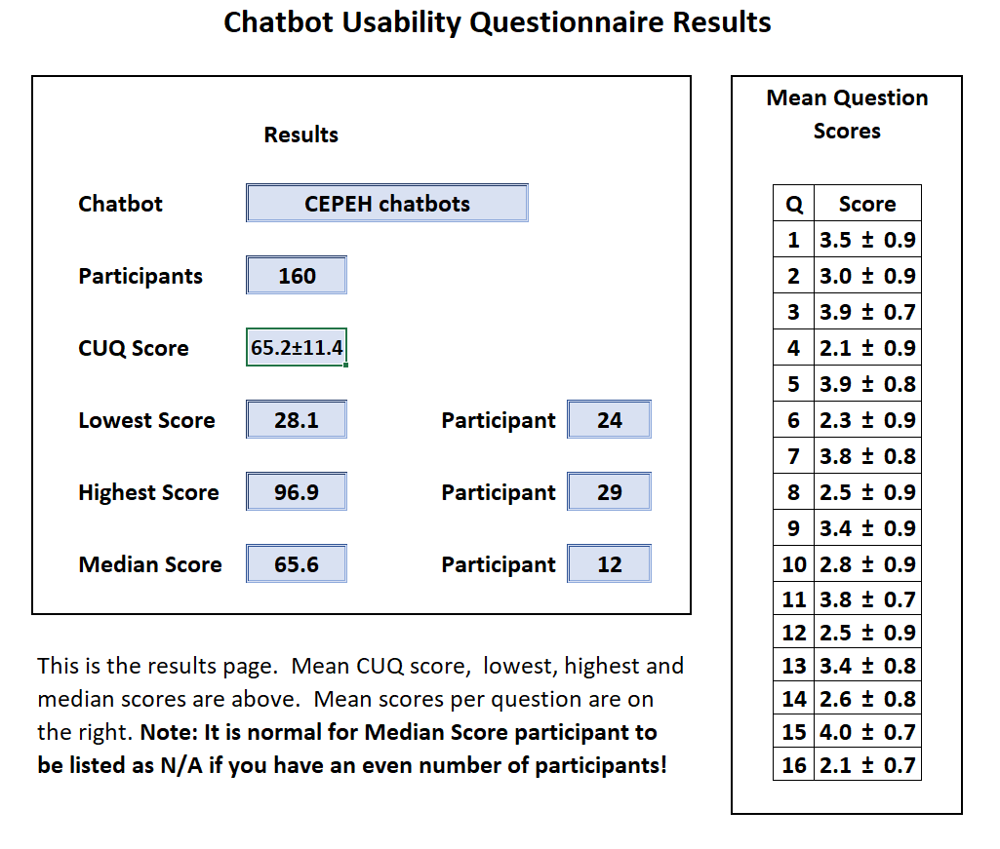

---
output:
  bookdown::pdf_document2:
    template: templates/template.tex
  bookdown::html_document2: default
  bookdown::word_document2: default
documentclass: book
#bibliography: [bibliography/references.bib, bibliography/additional-references.bib]
editor_options: 
  markdown: 
    wrap: 72
---
<style>
body {
text-align: justify}
</style>
# Results {#rmd-basics}

\minitoc <!-- this will include a mini table of contents-->

<!-- LaTeX normally does not indent the first line after a heading - however, it does so after the mini table of contents. You can manually tell it not to with \noindent -->
\noindent

```{r Importing Data 2, message=FALSE, warning=FALSE, include=FALSE, paged.print=FALSE}


knitr::opts_chunk$set(
	echo = FALSE,
	message = FALSE,
	warning = FALSE
)

required_packages <- c("rmarkdown", "bookdown", "knitr", "kableExtra", "tidyverse", "here", "readxl", "ggplot2", "lubridate", "plotly", "dplyr", "wesanderson", "viridis","leaflet")

for (package in required_packages) {
  if (!requireNamespace(package)) install.packages(package, repos = "http://cran.rstudio.com")
}

library(readxl)
library(ggplot2)
library(lubridate)
library(plotly)
library(dplyr)
#color pallets
library(wesanderson)
library(viridis)
library(knitr)
library(tidyverse)
library(leaflet)
library(excelR)


try(data <- read_excel("C:/Users/MattP/Desktop/Full DATA CEPEH moh.xlsx"))

sex <- data$sex
sex <- data.frame(sex)

disc <- subset(data, select = "Location")
disc <- na.omit(disc)
colnames(disc)[1] = "Location"
```

## Learner Characteristics

When asked the amount of time participants have used a chatbot- in any form or subject: 23 stated they had never used a chatbot, educational or not. Further, 18/42 having used a chatbot at least once for between 0-4 hours of use in total. Two individuals had spent much longer time with usage- these were a learning technologist associated with the CEPEH team, and a mature student. 
In short, this sample of participants did not regularly use chatbots for their course learning, but 1/3 had used one in some form previously.

Most learners use books or online books as resources. They may use multiple sources however they were asked to note
the primary source. Only 6 stated their primary sources were *Online videos/interactive materials* which includes
such tools as chatbots.

The first boxplot (\@ref(fig:Boxplotsplits2)) shows learners perceptions of easy of use of mobile app and other educational mobile resources

```{r Boxplotsplits2, echo=FALSE, fig.cap="Usage Frequency-Pre", message=FALSE, warning=FALSE}

library(tidyverse)
library(readr)

Boxplotsplits2 <- read.csv("C:/Users/MattP/Desktop/cepeh R/Full DATA CEPEH Moh - Copy.csv", header=TRUE, na.strings=c("", "NA"))

#------make ggplot this way, instead of making a dataset, this is better as you can just filter and skips steps
Boxplotsplits2 %>%
  
  filter(Use_chatbots_frequently_pre %in% c("Strongly Agree","Agree","Neutral","Disagree","Strongly Disagree")) %>%
           
           drop_na(Use_chatbots_frequently_pre) %>%
  drop_na(Profession)%>%
#------then pipe into ggplot
  #the first aesthetic label is always the x axis
  ggplot(aes(Profession))+
  geom_bar(aes(fill = Use_chatbots_frequently_pre), alpha = 0.8)+
  facet_wrap(~Profession)+
  theme_get()+
  theme(panel.grid.major = element_blank(),
        panel.grid.minor = element_blank(),
        axis.title.x=element_blank(),
        axis.text.x=element_blank(),
        axis.ticks.x=element_blank())+
                 labs(title="I would like to use chatbots frequently-Pre",
                      x= "Like to use chatbots frequently (Pre)",
                      y= "Frequency")
```


```{r BoxplotUsefulPre, echo=FALSE, fig.cap="Useful Opinion-Pre", message=FALSE, warning=FALSE, paged.print=TRUE}

library(tidyverse)
library(readr)

try(Boxplotsplits2 <- read_excel("C:/Users/MattP/Desktop/Full DATA CEPEH Moh.xlsx"))

Boxplotsplits2<- na.omit(Boxplotsplits2)

#------make ggplot this way, instead of making a dataset, this is better as you can just filter and skips steps
Boxplotsplits2 %>%
  
  filter(UsefulPE1PRE %in% c("Strongly Agree","Agree","Neutral","Disagree","Strongly Disagree")) %>%
           
           drop_na(UsefulPE1PRE) %>%
  drop_na(ChatbotUsed)%>%
#------then pipe into ggplot
  #the first aesthetic label is always the x axis
  ggplot(aes(ChatbotUsed))+
  geom_bar(aes(fill = ChatbotUsed), alpha = 0.8)+
  facet_wrap(~UsefulPE1PRE)+
  theme_get()+
  theme(panel.grid.major = element_blank(),
        panel.grid.minor = element_blank(),
        axis.title.x=element_blank(),
        axis.text.x=element_blank(),
        axis.ticks.x=element_blank())+
                 labs(title="I think chatbots are useful -Pre",
                      x= "Like to use chatbots frequently (Pre)",
                      y= "Frequency")

```


```{r previous chatbot use, echo=FALSE, message=FALSE, warning=FALSE}

# table for previous chatbot usage
prevchat <- subset(data, select = c("Previous_Chatbot_Usage"))
prevchat <- na.omit(prevchat)
colnames(disc)[1] = "Previous_Chatbot_Usage"

knitr::kable(prevchat <-prevchat %>% filter(Previous_Chatbot_Usage %in% c("Never","1-4 hours", "5-9 hours","20+ hours","10-19 hours",format('html'))) %>% group_by(Previous_Chatbot_Usage) %>% count(Previous_Chatbot_Usage),"pipe", decreasing = TRUE)
```


# Post-Intervention Results and Comparision

## System Usability Scale (SUS) Scores

*Note= The amount of 'agreement' is defined as the addition of 'Agree'
and 'Strongly agree' responses.*

The SUS score should consist of 10 items. However, some SUS questions
were improved upon by 1 or more CUQ questions, specifically to this
Chatbot study. The SUS results would be overshadowed by the CUQ scores,
expect 2 that did not have cross-over. The two questions were:

-   I would like to use the CEPEH chatbot I tested, more frequently
    (SUS1)(post)
-   I felt confident using the CEPEH chatbot (SUS2)(post)

This meant the score of the SUS was not created, however the CUQ score
better represented the Learners' perceptions of the CEPEH chatbot in
terms of feasibility of reuse and acceptability in healthcare curricula.

```{r SUS table 2 questions, echo=FALSE, message=FALSE, warning=FALSE, paged.print=FALSE}

# table for sus results

SUS2 <- subset(data, select = c("I would like to use the CEPEH chatbot i tested, more frequently (SUS1)(post)", "I felt confident using the CEPEH chatbot (SUS2)(post)"))
SUS2 <- na.omit(SUS2)
colnames(SUS2)[1] = "KeepUsing"
colnames(SUS2)[2] = "Confident"

library(plyr)

counts <- ddply(SUS2, .(SUS2$KeepUsing, SUS2$Confident), nrow)
names(counts) <- c("KeepUsing", "Confident", "V1")


colnames(counts)[1] = "Keep_Using_Chatbots"
colnames(counts)[2] = "Confident"
colnames(counts)[3] = "Count"

knitr::kable(counts[order(counts$Keep_Using_Chatbots), ],"pipe")
```

```{r graphs2, eval=FALSE, message=FALSE, warning=FALSE, include=FALSE}

ggplot(year, aes(year)) + geom_bar(color="purple", fill=rgb(0.2,0.3,0.9,0.7) ) + scale_x_continuous(breaks = seq(2006, 2022,1)) + theme(plot.title = element_text(face="bold.italic"))
```

```{r Recommend table 1, eval=FALSE, message=FALSE, warning=FALSE, comment=NA, include=FALSE, paged.print=TRUE}

rec <- subset(data, select = c("Recommend","Identity"))
rec <- na.omit(rec)

knitr::kable(rec <-rec %>% filter(Identity == c("HE student","Healthcare professional", "Other", "Student","Tutor/Teacher/Lecturer","Patient/Service-user/Carer",format('html'))) %>% group_by(Identity, Recommend) %>% count(Recommend), "pipe")

```

```{r Helpful table 1, eval=FALSE, message=FALSE, warning=FALSE, comment=NA, include=FALSE, paged.print=TRUE}

RLO <- subset(data, select = c("Identity","RLO Helpful"))
RLO <- na.omit(RLO)
colnames(RLO)[2] = "RLO" 
knitr::kable(RLO <- RLO %>% filter(Identity == c("HE student","Healthcare professional", "Other", format('html'), "Student","Tutor/Teacher/Lecturer", "Patient/Service-user/Carer")) %>% group_by(Identity, RLO) %>% count(RLO), "pipe")

```

```{r barplot, eval=FALSE, message=FALSE, warning=FALSE, include=FALSE}
# stacked horizontal bar plot of RLO X identity 
##dataset RLOk 
RLOk <- na.omit(RLO) 

## the bar plot
ggplot(RLOk, aes(fill = RLO, x = Identity)) + geom_bar(width=0.5,position = "fill") + coord_flip() + ggtitle("How helpful has this learning object been?") + theme(plot.title = element_text(face="bold.italic")) + ylab("Scale of how helpful (0-1) ") + xlab("") + scale_fill_viridis(discrete = TRUE,option = "D") 

```


## Technology Acceptance Model

The TAM had 3 sections (Ease of Use, Perceived Usefulness, and Intention
of Use). Ease of Use results showed significant increases in Users'
usage with each Chatbot. Perceived Usefulness: There were not
significant findings for the Perceived usefulness. The justification for
this may be due to being early versions of applications with limited
functionality and functions which can be difficult for user to
experience the intended further range of features and learning
exercises.

Intention of Use: For users' intentions to use within their course, the
result of the Mann-Whitney U test was not significant, U = , z = , p = .
in their intentions before use (m=xx, mode=xx) compared to after (m=xx,
mode=x), however there was improvement therefore the chatbots may have
more benefit than expected by students.


## Chatbot Usabilty Questionanire (CUQ)

### CUQ Calcuation tool

The CUQ was developed by researchers at Ulster University,[Link](<a href="https://www.ulster.ac.uk/research/topic/computer-science/artificial-intelligence/projects/cuq") 
and as the calculation can be complex a dedicated calculation tool has been created.
Please download the CEPEH CUQ calculation tool which has all of the data entered, so you can see the CEPEH CUQ scoring.

[click here to download CUQ calc tool](CUQ-Calculation-Tool.xlsx)

[click here to download CUQ score image](cuq.png)
*mobile download disabled

```{r cuq image, echo=FALSE, fig.align='center', fig.cap="A marvel-lous meme", message=FALSE, warning=FALSE, out.width="75%"}

```

The score for all 3 chatbots grouped was 65.2/100, 
This scoring system was designed to be comparable to SUS and may be
freely used alongside it, or in combination with other usability
metrics. There has been evidence of correlation of 76% between the CUQ
and SUS therefore we expect the SUS scored to be between 48.75 and 81%.
We believe the CUQ has more validity towards measuring the concepts of
interest on this study.

[Read the CUQ development paper, see page 3 for correlation](<a href="https://dl.acm.org/doi/pdf/10.1145/3335082.3335094?casa_token=rGs2gNvKuLkAAAAA:Cd8Qn3QywYHZGYJzbD5CU1dVFWHPLGzDnmQYue6ix-AcqOkWLa7VN4GuzvfrZR2DhhvEAoZOF_2T)
```{r eval=FALSE, message=FALSE, warning=FALSE, include=FALSE}
library(readr)
mydata.needed <- read_csv("Full DATA CEPEH Moh - Copy.csv")

plot(CUQ,
     main="Chatbot Usability Questionnaire Scoring",
     xlab="Participant Data (All 4 chatbots)",
     ylab="Scoring out of 100",
     col="blue")
      
```
Figure shows the CUQ scores as a box plot to highlight the range of Usability of the resources. Further exploration is required to understand which elements are causing this spread.  


```{r Boxplotsplits5, echo=FALSE, message=FALSE, warning=FALSE}

library(tidyverse)
library(readr)

Boxplotsplits5 <- read.csv("C:/Users/MattP/Desktop/cepeh R/Full DATA CEPEH Moh - Copy.csv", header=TRUE, na.strings=c("", "NA"))

#------make ggplot this way, instead of making a dataset, this is better as you can just filter and skips steps
Boxplotsplits5 %>%
  
  filter(knowledge_improved_after_use%in% c("Strongly Agree","Agree","Neutral","Disagree","Strongly Disagree")) %>%
           
           drop_na(knowledge_improved_after_use) %>%
  drop_na(knowledge_improved_after_use)%>%
#------then pipe into ggplot
  #the first aesthetic label is always the x axis
  ggplot(aes(ChatbotUsed))+
  geom_bar(aes(fill = ChatbotUsed), alpha = 0.8)+
  facet_wrap(~knowledge_improved_after_use)+
  theme_get()+
  theme(panel.grid.major = element_blank(),
        panel.grid.minor = element_blank(),
        axis.title.x=element_blank(),
        axis.text.x=element_blank(),
        axis.ticks.x=element_blank())+
                 labs(title="My Knowledge of the Topic Improved after Use",
                      x= "",
                      y= "Frequency")
```
CYENS chatbot had around 10 more participants stating that they were neutral on gaining knowledge of the topic

```{r Boxplotsplits6, echo=FALSE, message=FALSE, warning=FALSE}

library(tidyverse)
library(readr)

Boxplotsplits6 <- read.csv("C:/Users/MattP/Desktop/cepeh R/Full DATA CEPEH Moh - Copy.csv", header=TRUE, na.strings=c("", "NA"))

#------make ggplot this way, instead of making a dataset, this is better as you can just filter and skips steps
Boxplotsplits6 %>%
  
  filter(POST_Trust%in% c("Strongly Agree","Agree","Neutral","Disagree","Strongly Disagree")) %>%
           
           drop_na(POST_Trust) %>%
  drop_na(POST_Trust)%>%
#------then pipe into ggplot
  #the first aesthetic label is always the x axis
  ggplot(aes(ChatbotUsed))+
  geom_bar(aes(fill = ChatbotUsed), alpha = 0.8)+
  facet_wrap(~POST_Trust)+
  theme_get()+
  theme(panel.grid.major = element_blank(),
        panel.grid.minor = element_blank(),
        axis.title.x=element_blank(),
        axis.text.x=element_blank(),
        axis.ticks.x=element_blank())+
                 labs(title="I Trust CEPEH Chatbots to Provide me with my Course Information",
                      x= "",
                      y= "Frequency")
```

```{r Boxplotsplits7, echo=FALSE, message=FALSE, warning=FALSE}

library(tidyverse)
library(readr)

Boxplotsplits7 <- read.csv("C:/Users/MattP/Desktop/cepeh R/Full DATA CEPEH Moh - Copy.csv", header=TRUE, na.strings=c("", "NA"))

#------make ggplot this way, instead of making a dataset, this is better as you can just filter and skips steps
Boxplotsplits7 %>%
  
  filter(Personailty_real_engage %in% c("Strongly Agree","Agree","Neutral","Disagree","Strongly Disagree")) %>%
           
           drop_na(Personailty_real_engage) %>%
  drop_na(Personailty_real_engage)%>%
#------then pipe into ggplot
  #the first aesthetic label is always the x axis
  ggplot(aes(ChatbotUsed))+
  geom_bar(aes(fill = ChatbotUsed), alpha = 0.8)+
  facet_wrap(~Personailty_real_engage)+
  theme_get()+
  theme(panel.grid.major = element_blank(),
        panel.grid.minor = element_blank(),
        axis.title.x=element_blank(),
        axis.text.x=element_blank(),
        axis.ticks.x=element_blank())+
                 labs(title="CEPEH Chatbot Personailty was Realistic and Engaging",
                      x= "",
                      y= "Frequency")
```
There was mixed results for the chatbot used being realistic and engaging. This question has two descriptive terms however based on the other results we understand that the chatbots' NLP logic, or ability to respond required improvement to be more 'smooth' in replying. The primary limitation was found in the 'robotic' interactions(See Figure 10). This was investigated further in the 'Text Mining' and 'Sentiment Analysis' sections.

```{r Boxplotsplits8, echo=FALSE, message=FALSE, warning=FALSE}

library(tidyverse)
library(readr)

Boxplotsplits8 <- read.csv("C:/Users/MattP/Desktop/cepeh R/Full DATA CEPEH Moh - Copy.csv", header=TRUE, na.strings=c("", "NA"))

#------make ggplot this way, instead of making a dataset, this is better as you can just filter and skips steps
Boxplotsplits8 %>%
  
  filter(Robotic_CUQ2_post %in% c("Strongly Agree","Agree","Neutral","Disagree","Strongly Disagree")) %>%
           
           drop_na(Robotic_CUQ2_post) %>%
  drop_na(Robotic_CUQ2_post)%>%
#------then pipe into ggplot
  #the first aesthetic label is always the x axis
  ggplot(aes(ChatbotUsed))+
  geom_bar(aes(fill = ChatbotUsed), alpha = 0.8)+
  facet_wrap(~Robotic_CUQ2_post)+
  theme_get()+
  theme(panel.grid.major = element_blank(),
        panel.grid.minor = element_blank(),
        axis.title.x=element_blank(),
        axis.text.x=element_blank(),
        axis.ticks.x=element_blank())+
                 labs(title="The chatbot seemed too robotic (CUQ2)(post)",
                      x= "",
                      y= "Frequency")
```


```{r Boxplotsplits9, echo=FALSE, message=FALSE, warning=FALSE}

library(tidyverse)
library(readr)

Boxplotsplits9 <- read.csv("C:/Users/MattP/Desktop/cepeh R/Full DATA CEPEH Moh - Copy.csv", header=TRUE, na.strings=c("", "NA"))

#------make ggplot this way, instead of making a dataset, this is better as you can just filter and skips steps
Boxplotsplits9 %>%
  
  filter(CEPEH_Post_Easy_To_Use %in% c("Strongly Agree","Agree","Neutral","Disagree","Strongly Disagree")) %>%
           
           drop_na(CEPEH_Post_Easy_To_Use) %>%
  drop_na(Easy_To_Use_Pre)%>%
#------then pipe into ggplot
  #the first aesthetic label is always the x axis
  ggplot(aes(Easy_To_Use_Pre))+
  geom_bar(aes(fill = Easy_To_Use_Pre), alpha = 0.8)+
  facet_wrap(~CEPEH_Post_Easy_To_Use)+
  theme_get()+
  theme(panel.grid.major = element_blank(),
        panel.grid.minor = element_blank(),
        axis.title.x=element_blank(),
        axis.text.x=element_blank(),
        axis.ticks.x=element_blank())+
                 labs(title="Change in Ease of Use Perception, after CEPEH Chatbot Usage",
                      x= "",
                      y= "Frequency")
```

```{r Boxplotsplits10, echo=FALSE, message=FALSE, warning=FALSE}

library(tidyverse)
library(readr)

Boxplotsplits10 <- read.csv("C:/Users/MattP/Desktop/cepeh R/Full DATA CEPEH Moh - Copy.csv", header=TRUE, na.strings=c("", "NA"))

#------make ggplot this way, instead of making a dataset, this is better as you can just filter and skips steps
Boxplotsplits10 %>%
  
  filter(get_help %in% c("Strongly Agree","Agree","Neutral","Disagree","Strongly Disagree")) %>%
           
           drop_na(get_help) %>%
  drop_na(get_help_pre)%>%
#------then pipe into ggplot
  #the first aesthetic label is always the x axis
  ggplot(aes(get_help_pre))+
  geom_bar(aes(fill =get_help_pre), alpha = 0.8)+
  facet_wrap(~get_help)+
  theme_get()+
  theme(panel.grid.major = element_blank(),
        panel.grid.minor = element_blank(),
        axis.title.x=element_blank(),
        axis.text.x=element_blank(),
        axis.ticks.x=element_blank())+
                 labs(title="I can get help when I have difficulties using CEPEH chatbots",
                      x= "",
                      y= "Frequency")
```
Those who disagreed or were neutral in the pre usage measure, improved their understanding that help was available 
with the CEPEH chatbots. After usage, 40 participants agreed they could get help if they had difficulty using the 
resources.

--------------------------------------------------------------------


## Inferential Statistics

### Repeated Measures T-test results

After using the CEPEH chatbots, majority of participants stated they would reuse the chatbots. However, there was 6 counts of *disagree* or *strongly disagree* for all 4 chatbots. Further, there were 17 counts of neutral in reuse, which was approximately 4 participants per chatbot (see (\@ref(fig:Boxplotsplits4)).

```{r Boxplotsplits4, fig.cap="Intend to Reuse-Post", echo=FALSE, message=FALSE, warning=FALSE}

library(tidyverse)
library(readr)

Boxplotsplits4 <- read.csv("C:/Users/MattP/Desktop/cepeh R/Full DATA CEPEH Moh - Copy.csv", header=TRUE, na.strings=c("", "NA"))

#------make ggplot this way, instead of making a dataset, this is better as you can just filter and skips steps
Boxplotsplits4 %>%
  
  filter(Intend %in% c("Strongly Agree","Agree","Neutral","Disagree","Strongly Disagree")) %>%
           
           drop_na(Intend) %>%
  drop_na(Intend)%>%
#------then pipe into ggplot
  #the first aesthetic label is always the x axis
  ggplot(aes(ChatbotUsed))+
  geom_bar(aes(fill = ChatbotUsed), alpha = 0.8)+
  facet_wrap(~Intend)+
  theme_get()+
  theme(panel.grid.major = element_blank(),
        panel.grid.minor = element_blank(),
        axis.title.x=element_blank(),
        axis.text.x=element_blank(),
        axis.ticks.x=element_blank())+
                 labs(title="I Intend to again use the CEPEH Chatbots",
                      x= "",
                      y= "Frequency")
```


For CYENS, even though the knowledge of the topic was not perceived to improve by some participants, this box plot shows how 34/42 stated they would reuse the chatbot developed by CYENS.


```{r Boxplotsplits3, fig.cap="Easy to Use- Post", echo=FALSE, message=FALSE, warning=FALSE}

library(tidyverse)
library(readr)

Boxplotsplits3 <- read.csv("C:/Users/MattP/Desktop/cepeh R/Full DATA CEPEH Moh - Copy.csv", header=TRUE, na.strings=c("", "NA"))

#------make ggplot this way, instead of making a dataset, this is better as you can just filter and skips steps
Boxplotsplits3 %>%
  
  filter(Information_with_minimal_command_post %in% c("Strongly Agree","Agree","Neutral","Disagree","Strongly Disagree")) %>%
           
           drop_na(Information_with_minimal_command_post) %>%
  drop_na(Information_with_minimal_command_post)%>%
#------then pipe into ggplot
  #the first aesthetic label is always the x axis
  ggplot(aes(ChatbotUsed))+
  geom_bar(aes(fill = ChatbotUsed), alpha = 0.8)+
  facet_wrap(~Information_with_minimal_command_post)+
  theme_get()+
  theme(panel.grid.major = element_blank(),
        panel.grid.minor = element_blank(),
        axis.title.x=element_blank(),
        axis.text.x=element_blank(),
        axis.ticks.x=element_blank())+
                 labs(title="CEPEH Chatbots are Easy to Use",
                      x= "Like to use chatbots frequently (Pre)",
                      y= "Frequency")
```
There was only 1 'Strongly Disagree' response.
The agreement options counted for the majority of the data. 


### Other Findings

Other questions

I intend to continue using chatbots in the future (BI1)

The chatbot provided the information I needed with minimal commands

My knowledge of the topic improved after i had used the Chatbot

My confidence in understanding the topic improved after I had used the Chatbot

The chatbot provided me with the type of response i expected from asking a tutor/lecturer

The information provided was reliable

The chatbot has a high level of trustworthiness

The duration of conversations to find my answer was too long

The videos/images provided were useful to my questions

The chatbot exceeded my expectation of how it could help me

The chatbot exceeded my expectation of how it could engage with me

I think this learning method could help me to acquire knowledge

I would use this tool again as it has some value to me

I think i will actively use this learning method

I believe I had some choice about learning during chatbot use

I would trust the chatbot to provide me with information for my course

One piece of knowledge i learned from the chatbot was..

```{r second setup stuff 3, message=FALSE, warning=FALSE, comment=NA, include=FALSE, paged.print=FALSE}

library(readxl)
library(ggplot2)
library(lubridate)
library(plotly)
library(dplyr)
#color pallets
library(wesanderson)
library(viridis)
library(knitr)
library(tidyverse)


```


Repeated Measures t-test, aka paired t-test (before and after measurements)

```{r T-test, message=FALSE, warning=FALSE, include=FALSE}

library(readr)

mydata.needed <- read_csv("Full DATA CEPEH Moh - Copy.csv")

attach(mydata.needed)
names(mydata.needed)
mydata.needed[1:3]

plot(CUQ)

t.test(CUQ, after, mu=0, alt="two.sided", paired=T, conf.level=0.095)


```
This t-test compares confident using mobile chatbots before and after CEPEH chatbot usage. 


