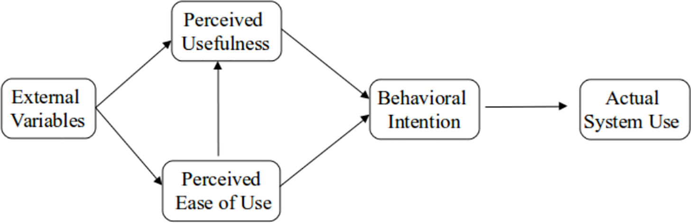

---
output:
  bookdown::pdf_document2:
    template: templates/template.tex
  bookdown::html_document2: default
  bookdown::word_document2: default
documentclass: book
#bibliography: [bibliography/references.bib, bibliography/additional-references.bib]
editor_options: 
  markdown: 
    wrap: 72
  chunk_output_type: console
---

```{=html}
<style>
body {
text-align: justify}
</style>
```
# Results {#rmd-basics}

\minitoc <!-- this will include a mini table of contents-->

<!-- LaTeX normally does not indent the first line after a heading - however, it does so after the mini table of contents. You can manually tell it not to with \noindent -->

\noindent

```{r Importing Data 2, message=FALSE, warning=FALSE, include=FALSE, paged.print=FALSE}

knitr::opts_chunk$set(
	echo = FALSE,
	message = FALSE,
	warning = FALSE
)

required_packages <- c("rmarkdown", "bookdown", "knitr", "kableExtra", "tidyverse", "here", "readxl", "ggplot2", "lubridate", "plotly", "dplyr", "wesanderson", "viridis","leaflet")

for (package in required_packages) {
  if (!requireNamespace(package)) install.packages(package, repos = "http://cran.rstudio.com")
}

library(readxl)
library(ggplot2)
library(lubridate)
library(plotly)
library(dplyr)
#color pallets
library(wesanderson)
library(viridis)
library(knitr)
library(tidyverse)
library(leaflet)
library(excelR)


try(data <- read_excel("C:/Users/MattP/Desktop/Full DATA CEPEH moh.xlsx"))

sex <- data$sex
sex <- data.frame(sex)

disc <- subset(data, select = "Location")
disc <- na.omit(disc)
colnames(disc)[1] = "Location"
```

## Participants' Characteristics

When participants were asked the amount of time they have used a chatbot
in any form or subject, 23 stated they had never used a chatbot.
Further, 19/42 stated having used a chatbot at least once for between
0-4 hours of use in total. These are likely commercial/website- based
assistant chatbots however there are some medical/healthcare resources
known to be used in anatomy and/or patient interactions. One individual
had spent much longer time with usage- this was the mature student.

```{r previous chatbot use, echo=FALSE, message=FALSE, warning=FALSE}

# table for previous chatbot usage
prevchat <- subset(data, select = c("Previous_Chatbot_Usage"))

knitr::kable(prevchat <-prevchat %>% filter(Previous_Chatbot_Usage %in% c("Never","1-4 hours","5-9 hours","20+ hours","10-19 hours",format('html'))) %>% group_by(Previous_Chatbot_Usage)%>% count(),"pipe",decreasing = TRUE)
```

Table: Previous Chatbot Usage of Participants

In short, approximately 50% had never used a chatbot, and 45% had used a
chatbot, at some period over the years, for a short period of time.

```{r Boxplotsplits2, echo=FALSE, fig.cap="Chatbot Usage History- Pre", message=FALSE, warning=FALSE}

library(tidyverse)
library(readr)

Boxplotsplits2 <- read.csv("C:/Users/MattP/Desktop/Full DATA CEPEH Moh - Copy.csv", header=TRUE, na.strings=c("", "NA"))

#------make ggplot this way, instead of making a dataset, this is better as you can just filter and skips steps
Boxplotsplits2 %>%
  
  filter(Profession %in% c("Healthcare_Student","Doctor","Learning Technologist","College student","Postgraduate student", "Medical doctor","Lecturer","Mature Student")) %>%
           
           
#------then pipe into ggplot
  #the first aesthetic label is always the x axis
  ggplot(aes(Profession))+
  geom_bar(aes(fill = Profession), alpha = 0.8)+
  facet_wrap(~Use_chatbots_frequently_pre)+
  theme_get()+
  theme(panel.grid.major = element_blank(),
        panel.grid.minor = element_blank(),
        axis.title.x=element_blank(),
        axis.text.x=element_blank(),
        axis.ticks.x=element_blank())+
                 labs(title="I would like to use chatbots frequently- Pre",
                      x= "Like to use chatbots frequently (Pre)",
                      y= "Frequency")
```

Most learners use books or online books as resources. They may use
multiple sources however they were asked to note the primary source.
Only 6 stated their primary sources were *Online videos/interactive
materials* which includes such tools as chatbots.

The first boxplot (\@ref(fig:Boxplotsplits2)) shows learners perceptions
of easy of use of mobile app and other educational mobile resources

```{r BoxplotUsefulPre, echo=FALSE, fig.cap="Chatbots are Useful Opinion- Pre", message=FALSE, warning=FALSE, paged.print=TRUE}

library(tidyverse)
library(readr)
library(ggcharts)

try(Boxplotsplits2 <- read_excel("C:/Users/MattP/Desktop/Full DATA CEPEH Moh.xlsx"))


#------make ggplot this way, instead of making a dataset, this is better as you can just filter and skips steps
Boxplotsplits2 %>%
  
  filter(UsefulPE1PRE %in% c("Strongly Agree","Agree","Neutral","Disagree","Strongly Disagree")) %>%
           
#------then pipe into ggplotggplot(aes(ChatbotUsed))+
  
  #the first aesthetic label is always the x axis
  ggplot(aes(UsefulPE1PRE))+
  geom_bar(aes(fill = Profession), alpha = 0.8)+
  scale_y_continuous(labels = function(x) paste0(x * 2.5, '%'))+
 facet_wrap(~UsefulPE1PRE)+
  theme_get()+ 
  theme(panel.grid.major = element_blank(),
        panel.grid.minor = element_blank(),
        axis.title.x=element_blank(),
        axis.text.x=element_blank())+
                 labs(title="     I think healthcare chatbots are useful- Pre",
                      x= "Like to use chatbots frequently (Pre)",
                      y= "Frequency")

```

(\@ref(fig:BoxplotUsefulPre)) shows the opinions of all participants on
the usefulness of chatbots. Many had not had experience with them yet
had positive rating. This positive opinions of chatbots may be from
colleagues, friends, media, tutors, or other social information of the
benefits in healthcare education. Around 25% were neutral or disagreed
that healthcare chatbots were useful.

***The participants then used the 4 chatbots, and completed the
post-usage survey after each chatbot. Results after use are as
followed:***

## Chatbot Usability Questionnaire (CUQ)

### CUQ Calculation tool

The CUQ was developed by researchers at Ulster University,
[Link](https://www.ulster.ac.uk/research/topic/computer-science/artificial-intelligence/projects/cuq)
and as the calculation can be complex, a dedicated calculation tool has
been created.

Please download the CEPEH CUQ calculation tool which has all of the data
entered, so you can see the CEPEH CUQ scoring

[Click here to download CUQ calc tool](CUQ-Calculation-Tool.xlsx)

[Click here to download CEPEH CUQ score result](cuq.png)

```{r cuqimage, echo=FALSE, fig.align='center', fig.cap="CUQ CEPEH Score", message=FALSE, warning=FALSE, out.width="75%", paged.print=TRUE}
knitr::include_graphics("cuq.png")
```

Although the design and development was similar, each chatbot CUQ score
was calculated to understand how the topic content may affect usability:

The breakdown of the chatbots was:

-   Aristotle University of Thessaloniki CUQ score = 63/100
-   CYENS Centre of Excellence CUQ score = 67/100
-   Karolinska Institute CUQ score = 63/100
-   University of Nottingham CUQ score = 68/100

The score for all 3 chatbots grouped was 65/100. See Discussion CUQ
section for interpretation

```{r CUQscatterplot, echo=FALSE, fig.align='center', fig.cap="CUQ Scatter Plot", message=FALSE, warning=FALSE, paged.print=FALSE}
library(readr)
mydata.needed <- read_csv("Full DATA CEPEH Moh - Copy.csv")

attach(mydata.needed)
plot(CUQ,
     main="Chatbot Usability Questionnaire Scoring",
     xlab="Participant responce data (4 chatbots)",
     ylab="Scoring out of 100",
     col=factor(ChatbotUsed))
      legend("bottomright",
       legend = levels(factor(ChatbotUsed)),
       pch = 19,
       col = factor(levels(factor(ChatbotUsed))))
```

Figure (\@ref(fig:CUQscatterplot)) shows the CUQ scores as a scatter
plot to highlight how there was a moderate distribution of results.
Further exploration is required to understand which elements are causing
this spread, and if it was due to problems within a small group of
learners.

## System Usability Scale (SUS) Scores

*Note= The amount of 'agreement' is defined as the addition of 'Agree'
and 'Strongly agree' responses.*

The SUS score should consist of 10 items. However, some SUS questions
were improved upon by 1 or more CUQ questions, specifically to this
Chatbot study. The SUS results would be obscured by the CUQ scores,
expect 2 that did not have cross-over. The two questions were:

-   I would like to use the CEPEH chatbot I tested, more frequently
    (SUS1)(post)
-   I felt confident using the CEPEH chatbot (SUS2)(post)

This meant the score of the SUS was not created, however the CUQ score
better represented the Learners' perceptions of the CEPEH chatbot in
terms of feasibility of use and acceptability in healthcare curricula.

```{r SUS table 2 questions, echo=FALSE, message=FALSE, warning=FALSE, paged.print=FALSE}
# table for sus results
SUS2 <- subset(data, select = c("I would like to use the CEPEH chatbot i tested, more frequently (SUS1)(post)", "I felt confident using the CEPEH chatbot (SUS2)(post)"))
SUS2 <- na.omit(SUS2)
colnames(SUS2)[1] = "KeepUsing"
colnames(SUS2)[2] = "Confident"

library(plyr)

counts <- ddply(SUS2, .(SUS2$KeepUsing), nrow)
names(counts) <- c("Confident", "Responces")
knitr::kable((counts),"pipe")

```

The table above shows the results for agreement participants may
continue to use the CEPEH chatbots: 89/126 (70%) agreed or strongly
agreed. However, there were 23 records that learners were neutral or
disagree they would continue use.

```{r confidence}

counts <- ddply(SUS2, .(SUS2$Confident), nrow)
names(counts) <- c("Keep Using", "V1")

colnames(counts)[1] = "Confidence using CEPEH Chatbot(s)"
colnames(counts)[2] = "Responces"

knitr::kable((counts),"pipe")

```

This table shows the distribution of agreement for participants for all
4 chatbots. The table shows 90/126 records that participants feel they
are confident in using the chatbots. However, 21/126 (16%) were neutral
and 11/126 (8.5%) disagreed and this was explored in the qualitative
analysis section.

## Technology Acceptance Model

The TAM questions were analysed according to their subsets. The subsets
were Perceived Usefulness (PU) and Perceived Easy of Use (PEU)

The questions were: Perceived Usefulness (PU)

1.  Using CEPEH chatbots would enable me to accomplish tasks more
    quickly
2.  Using CEPEH chatbots would increase performance
3.  Using CEPEH chatbots would increase my productivity
4.  I would find CEPEH chatbots useful on my course

Perceived Easy of Use (PEU)

5.  Learning to use CEPEH chatbots would be easy to me

6.  It would be easy for me to be skilful at using CEPEH chatbots

7.  My interactions with CEPEH chatbots would be clear and
    understandable

8.  I would find CEPEH chatbots easy to use

*Results*

The scores as a percentage of agreement, were calculated by averaging
the subsets and interpreted as:

-   Before using the CEPEH chatbots, there was 66% (2.2/5) agreement for
    the Perceived Usefulness of chatbots in healthcare education, and
    after 48% (2.6/5) agreed.

-   Before using the CEPEH chatbots, there was 64% (2.3) agreement for
    Perceived Ease of Use of chatbots in healthcare education, and after
    51% (2.56) agreed.

The justification for this may be due to being early versions of
applications with limited functionality and functions which can be
difficult for user to experience the intended further range of features
and learning exercises.

```{r tam, echo=FALSE, fig.align='center', fig.cap="TAM Model processes", message=FALSE, warning=FALSE, out.width="75%", paged.print=TRUE}


```

## Other Measeures

### Knowledge of Topics after Use

```{r Boxplotsplits5, fig.cap="Improvements in Knowledge", echo=FALSE, message=FALSE, warning=FALSE}

library(tidyverse)
library(readr)

Boxplotsplits5 <- read.csv("C:/Users/MattP/Desktop/Full DATA CEPEH Moh - Copy.csv", header=TRUE, na.strings=c("", "NA"))

#------make ggplot this way, instead of making a dataset, this is better as you can just filter and skips steps
Boxplotsplits5 %>%
  
  filter(knowledge_improved_after_use%in% c("Strongly Agree","Agree","Neutral","Disagree","Strongly Disagree")) %>%
           
           drop_na(knowledge_improved_after_use) %>%
  drop_na(knowledge_improved_after_use)%>%
#------then pipe into ggplot
  #the first aesthetic label is always the x axis
  ggplot(aes(ChatbotUsed))+
  geom_bar(aes(fill = ChatbotUsed), alpha = 0.8)+
  facet_wrap(~knowledge_improved_after_use)+
  theme_get()+
  theme(panel.grid.major = element_blank(),
        panel.grid.minor = element_blank(),
        axis.title.x=element_blank(),
        axis.text.x=element_blank(),
        axis.ticks.x=element_blank())+
                 labs(title="My Knowledge of the Topic Improved after Use",
                      x= "",
                      y= "Frequency")
```

CYENS chatbot had around 10 more participants stating that they were
neutral on gaining knowledge of the topic

### Trust in CEPEH chatbots after Use

```{r Boxplotsplits6, echo=FALSE, fig.cap="Trust Chatbots POST use", message=FALSE, warning=FALSE}

library(tidyverse)
library(readr)

Boxplotsplits6 <- read.csv("C:/Users/MattP/Desktop/Full DATA CEPEH Moh - Copy.csv", header=TRUE, na.strings=c("", "NA"))

#------make ggplot this way, instead of making a dataset, this is better as you can just filter and skips steps
Boxplotsplits6 %>%
  
  filter(POST_Trust%in% c("Strongly Agree","Agree","Neutral","Disagree","Strongly Disagree")) %>%
           
           drop_na(POST_Trust) %>%
  drop_na(POST_Trust)%>%
#------then pipe into ggplot
  #the first aesthetic label is always the x axis
  ggplot(aes(ChatbotUsed))+
  geom_bar(aes(fill = ChatbotUsed), alpha = 0.8)+
  facet_wrap(~POST_Trust)+
  theme_get()+
  theme(panel.grid.major = element_blank(),
        panel.grid.minor = element_blank(),
        axis.title.x=element_blank(),
        axis.text.x=element_blank(),
        axis.ticks.x=element_blank())+
                 labs(title="I Trust CEPEH Chatbots to Provide me with my Course Information",
                      x= "",
                      y= "Frequency")
```

The figure above, (\@ref(fig:Boxplotsplits6)) shows the ratings by
participants of the CEPEH Chatbots to provide them with the necessary
course information. This is a integral element in learners' motivational
and educational choices to reuse the learning resources. As previously
described, the trust of the information is also a factor in these
responses.

```{r Boxplotsplits7, echo=FALSE, message=FALSE, warning=FALSE}

library(tidyverse)
library(readr)

Boxplotsplits7 <- read.csv("C:/Users/MattP/Desktop/Full DATA CEPEH Moh - Copy.csv", header=TRUE, na.strings=c("", "NA"))

#------make ggplot this way, instead of making a dataset, this is better as you can just filter and skips steps
Boxplotsplits7 %>%
  
  filter(Personailty_real_engage %in% c("Strongly Agree","Agree","Neutral","Disagree","Strongly Disagree")) %>%
           
           drop_na(Personailty_real_engage) %>%
  drop_na(Personailty_real_engage)%>%
#------then pipe into ggplot
  #the first aesthetic label is always the x axis
  ggplot(aes(ChatbotUsed))+
  geom_bar(aes(fill = ChatbotUsed), alpha = 0.8)+
  facet_wrap(~Personailty_real_engage)+
  theme_get()+
  theme(panel.grid.major = element_blank(),
        panel.grid.minor = element_blank(),
        axis.title.x=element_blank(),
        axis.text.x=element_blank(),
        axis.ticks.x=element_blank())+
                 labs(title="CEPEH Chatbot Personailty was Realistic and Engaging",
                      x= "",
                      y= "Frequency")
```

There was mixed results for the chatbot used being realistic and
engaging. This question has two descriptive terms however based on the
other results we understand that the chatbots' NLP logic, or ability to
respond required improvement to be more 'smooth' in replying. The
primary limitation was found in the 'robotic' interactions(See Figure
10). This was investigated further in the 'Text Mining' and 'Sentiment
Analysis' sections.

### Personailty and Interactions

```{r Boxplotsplits8, echo=FALSE, message=FALSE, warning=FALSE}

library(tidyverse)
library(readr)

Boxplotsplits8 <- read.csv("C:/Users/MattP/Desktop/Full DATA CEPEH Moh - Copy.csv", header=TRUE, na.strings=c("", "NA"))

#------make ggplot this way, instead of making a dataset, this is better as you can just filter and skips steps
Boxplotsplits8 %>%
  
  filter(Robotic_CUQ2_post %in% c("Strongly Agree","Agree","Neutral","Disagree","Strongly Disagree")) %>%
           
           drop_na(Robotic_CUQ2_post) %>%
  drop_na(Robotic_CUQ2_post)%>%
#------then pipe into ggplot
  #the first aesthetic label is always the x axis
  ggplot(aes(ChatbotUsed))+
  geom_bar(aes(fill = ChatbotUsed), alpha = 0.8)+
  facet_wrap(~Robotic_CUQ2_post)+
  theme_get()+
  theme(panel.grid.major = element_blank(),
        panel.grid.minor = element_blank(),
        axis.title.x=element_blank(),
        axis.text.x=element_blank(),
        axis.ticks.x=element_blank())+
                 labs(title="The chatbot seemed too robotic (CUQ2)(post)",
                      x= "",
                      y= "Frequency")
```

*The chatbot seemed too robotic* results had the largest mix of
responses, and for all 4 chatbots evaluated. The University of
Nottingham Cybersecurity chatbot had more deterministic pathways with
exploitation of the NLP modelling to provide illusion of realism. This
may explain why there was less agreement. However, Neutrality and/or
agreement was not desired.

The CYENS medical patient chatbot had more complex pathways of
interactions,

### Ease of Use and Seeking Support

```{r Boxplotsplits9, fig.cap="Ease of Use Comparison", echo=FALSE, message=FALSE, warning=FALSE}

library(tidyverse)
library(readr)

Boxplotsplits9 <- read.csv("C:/Users/MattP/Desktop/Full DATA CEPEH Moh - Copy.csv", header=TRUE, na.strings=c("", "NA"))

#------make ggplot this way, instead of making a dataset, this is better as you can just filter and skips steps
Boxplotsplits9 %>%
  
  filter(CEPEH_Post_Easy_To_Use %in% c("Strongly Agree","Agree","Neutral","Disagree","Strongly Disagree")) %>%
           
           drop_na(CEPEH_Post_Easy_To_Use) %>%
  drop_na(Easy_To_Use_Pre)%>%
#------then pipe into ggplot
  #the first aesthetic label is always the x axis
  ggplot(aes(Easy_To_Use_Pre))+
  geom_bar(aes(fill = Easy_To_Use_Pre), alpha = 0.8)+
  facet_wrap(~CEPEH_Post_Easy_To_Use)+
  theme_get()+
  theme(panel.grid.major = element_blank(),
        panel.grid.minor = element_blank(),
        axis.title.x=element_blank(),
        axis.text.x=element_blank())+
                 labs(title="Change in Ease of Use Perception, after CEPEH Chatbot Usage",
                      x= "",
                      y= "Frequency")
```

After usage, there was only agreement in Ease of Use- as shown in
(\@ref(fig:Boxplotsplits9) as there are no 'Neutral' or disagree
columns. Any learners with disagreement before using the CEPEH chatbots,
after believed they were easy to use.

```{r Boxplotsplits10, echo=FALSE, message=FALSE, warning=FALSE}

library(tidyverse)
library(readr)

Boxplotsplits10 <- read.csv("C:/Users/MattP/Desktop/Full DATA CEPEH Moh - Copy.csv", header=TRUE, na.strings=c("", "NA"))

#------make ggplot this way, instead of making a dataset, this is better as you can just filter and skips steps
Boxplotsplits10 %>%
  
  filter(get_help %in% c("Strongly Agree","Agree","Neutral","Disagree","Strongly Disagree")) %>%
           
           drop_na(get_help) %>%
  drop_na(get_help_pre)%>%
#------then pipe into ggplot
  #the first aesthetic label is always the x axis
  ggplot(aes(get_help_pre))+
  geom_bar(aes(fill =get_help_pre), alpha = 0.8)+
  facet_wrap(~get_help)+
  theme_get()+
  theme(panel.grid.major = element_blank(),
        panel.grid.minor = element_blank(),
        axis.title.x=element_blank(),
        axis.text.x=element_blank(),
        axis.ticks.x=element_blank())+
                 labs(title="I can get help when I have difficulties using CEPEH chatbots",
                      x= "",
                      y= "Frequency")
```

Those who disagreed or were neutral in the pre usage measure, improved
their understanding that help was available with the CEPEH chatbots.
After usage, 40 participants agreed they could get help if they had
difficulty using the resources.

## Inferential Statistics

### Repeated Measures T-test results

After using the CEPEH chatbots, majority of participants stated they
would reuse the chatbots. However, there was 6 counts of *disagree* or
*strongly disagree* for all 4 chatbots. Further, there were 17 counts of
neutral in reuse, which was approximately 4 participants per chatbot
(see (\@ref(fig:Boxplotsplits4)).

```{r Boxplotsplits4, fig.cap="Intend to Reuse-Post", echo=FALSE, message=FALSE, warning=FALSE}

library(tidyverse)
library(readr)

Boxplotsplits4 <- read.csv("C:/Users/MattP/Desktop/Full DATA CEPEH Moh - Copy.csv", header=TRUE, na.strings=c("", "NA"))

#------make ggplot this way, instead of making a dataset, this is better as you can just filter and skips steps
Boxplotsplits4 %>%
  
  filter(Intend %in% c("Strongly Agree","Agree","Neutral","Disagree","Strongly Disagree")) %>%
           
           drop_na(Intend) %>%
  drop_na(Intend)%>%
#------then pipe into ggplot
  #the first aesthetic label is always the x axis
  ggplot(aes(ChatbotUsed))+
  geom_bar(aes(fill = ChatbotUsed), alpha = 0.8)+
  facet_wrap(~Intend)+
  theme_get()+
  theme(panel.grid.major = element_blank(),
        panel.grid.minor = element_blank(),
        axis.title.x=element_blank(),
        axis.text.x=element_blank(),
        axis.ticks.x=element_blank())+
                 labs(title="I Intend to again use the CEPEH Chatbots",
                      x= "",
                      y= "Frequency")
```

For CYENS, even though the knowledge of the topic was not perceived to
improve by some participants, this box plot shows how 34/42 stated they
would reuse the chatbot developed by CYENS.

```{r Boxplotsplits3, fig.cap="Easy to Use- Post", echo=FALSE, message=FALSE, warning=FALSE}

library(tidyverse)
library(readr)

Boxplotsplits3 <- read.csv("C:/Users/MattP/Desktop/Full DATA CEPEH Moh - Copy.csv", header=TRUE, na.strings=c("", "NA"))

#------make ggplot this way, instead of making a dataset, this is better as you can just filter and skips steps
Boxplotsplits3 %>%
  
  filter(Information_with_minimal_command_post %in% c("Strongly Agree","Agree","Neutral","Disagree","Strongly Disagree")) %>%
           
           drop_na(Information_with_minimal_command_post) %>%
  drop_na(Information_with_minimal_command_post)%>%
#------then pipe into ggplot
  #the first aesthetic label is always the x axis
  ggplot(aes(ChatbotUsed))+
  geom_bar(aes(fill = ChatbotUsed), alpha = 0.8)+
  facet_wrap(~Information_with_minimal_command_post)+
  theme_get()+
  theme(panel.grid.major = element_blank(),
        panel.grid.minor = element_blank(),
        axis.title.x=element_blank(),
        axis.text.x=element_blank(),
        axis.ticks.x=element_blank())+
                 labs(title="CEPEH Chatbots are Easy to Use",
                      x= "Like to use chatbots frequently (Pre)",
                      y= "Frequency")
```

There was only 1 'Strongly Disagree' response. The agreement options
counted for the majority of the data.

## Other Findings

Other questions

I intend to continue using chatbots in the future (BI1)

The chatbot provided the information I needed with minimal commands

My knowledge of the topic improved after i had used the Chatbot

My confidence in understanding the topic improved after I had used the
Chatbot

The chatbot provided me with the type of response i expected from asking
a tutor/lecturer

The information provided was reliable

The chatbot has a high level of trustworthiness

The duration of conversations to find my answer was too long

The videos/images provided were useful to my questions

The chatbot exceeded my expectation of how it could help me

The chatbot exceeded my expectation of how it could engage with me

I think this learning method could help me to acquire knowledge

I would use this tool again as it has some value to me

I think I will actively use this learning method

I believe I had some choice about learning during chatbot use

I would trust the chatbot to provide me with information for my course

One piece of knowledge I learned from the chatbot was..

```{r second setup stuff 3, message=FALSE, warning=FALSE, comment=NA, include=FALSE, paged.print=FALSE}

library(readxl)
library(ggplot2)
library(lubridate)
library(plotly)
library(dplyr)
#color pallets
library(wesanderson)
library(viridis)
library(knitr)
library(tidyverse)


```

Repeated Measures t-test, aka paired t-test (before and after
measurements)

```{r T-test, message=FALSE, warning=FALSE, include=FALSE}

library(readr)

mydata.needed <- read_csv("Full DATA CEPEH Moh - Copy.csv")

attach(mydata.needed)
names(mydata.needed)
mydata.needed[1:3]

plot(CUQ)

t.test(CUQ, after, mu=0, alt="two.sided", paired=T, conf.level=0.095)


```

This t-test compares confident using mobile chatbots before and after
CEPEH chatbot usage.
