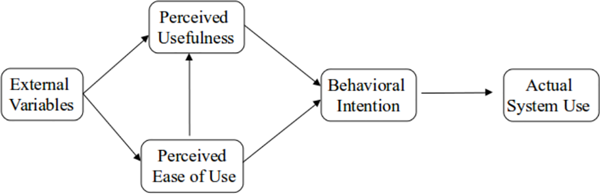

---
output:
  #bookdown::html_document2: default
  #bookdown::word_document2: default
  bookdown::pdf_document2:
    template: templates/template.tex
    keep_tex: true
  bookdown::html_document2: default
  bookdown::word_document2: default
documentclass: book
---

# Discussion {#Discussion}

\minitoc <!-- this will include a mini table of contents-->

##Summary of Findings

The Chatbots were beneficial. Learners have lots of other choices such as YouTube, but there is a certain need for personalised information gathering , this can save time and prevent learning incorrect information. This was one reason why they were rated positive as they are able to streamline data finding for learners in a format that is understandable and easy to them.

## Quantatative Results

### CUQ

Holmes et al. [<https://dl.acm.org/doi/10.1145/3335082.3335094>] designed the CUQ to be comparable with the system usability scale (SUS).

We have calculated both these scores out of 100 to allow the same benchmark, which is 68.
A score of 68 is at the centre of the range is thought of as "C".
The average benchmark for CUQ is 68, and in initial/pilot studies 68 may be considered higher than expected when considering technical issues, less developed user interfaces etc.

Previous studies evaluating chatbots have had similar score.
For example, in 2022 [Link](a%3C%20href= "https://pubmed.ncbi.nlm.nih.gov/35629252/") found a physical activity promotion chatbot received 64.5/100, with lowest score at 40.6  


### TAM


```{r tam, echo=FALSE, fig.align='center', fig.cap="TAM Model processes", message=FALSE, warning=FALSE, out.width="75%", paged.print=TRUE}


```

## Qualatative Results

## Limitations

## Conclusions

Those results can be interpreted that the learning objectives of the training event was chosen appropriately for the diverse audience including clinicians, academics, researchers, and learning technologists/IT specialist resulting to a successful training event that enable participants to take the acquired knowledge back to their organisations in order to co-design and implement.
As it was expected and can be depicted from self-confidence statements that some participants being very confident before the event, not all the objectives expected to be reached by everyone, since the training was targeting both technical and non-technical participants.
However, on both average and individual matched responses participants self-statements showed that they improved their knowledge and understanding in using co-creation approaches to develop digital education resources and in designing and developing chatbots as educational resources.
