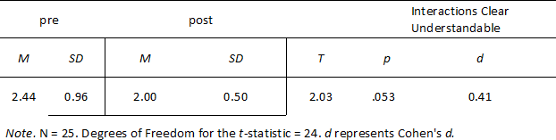
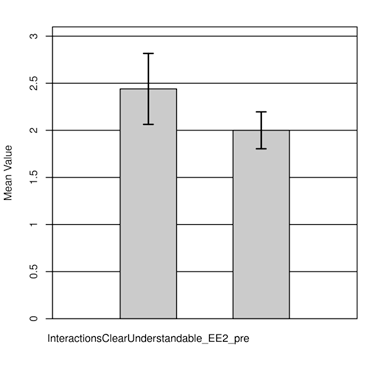
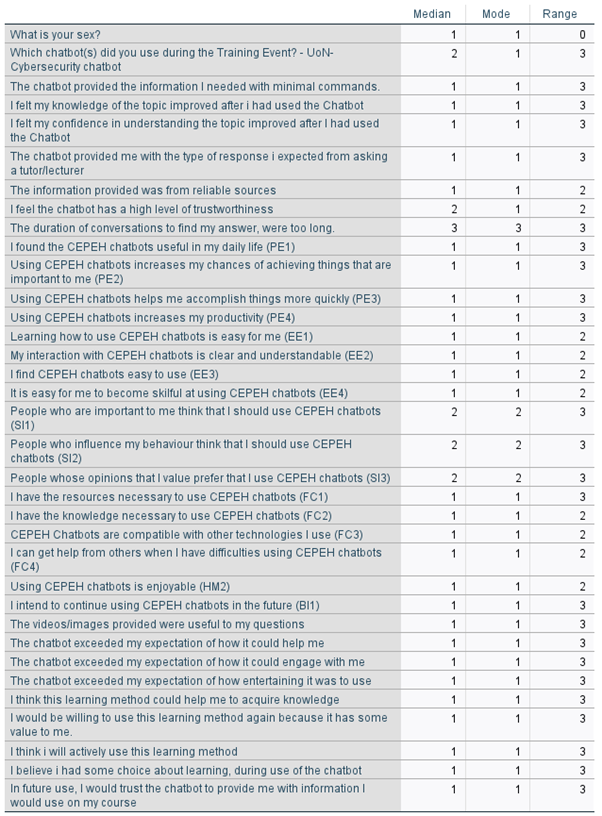

---
#####################
##  output format  ##
#####################
# The lines below makes the 'knit' button build the entire thesis 
# The format options are: 'pdf', 'bs4', 'gitbook', 'word'
# E.g. you can build both pdf and html with 'thesis_formats <- c("pdf", "bs4")'
knit: (function(input, ...) {
    thesis_formats <- c("bs4", "pdf", "word");
    
    source("scripts_and_filters/knit-functions.R");
    knit_thesis(input, thesis_formats, ...)
  })

#####################
##  metadata ##
#####################
title: |
  `Feasibility and Acceptance of Chatbots Embedded in Healthcare Curricula`: 
    
author: Matthew Pears, Eirini Schiza, James Henderson, Natalia Stathakarou, Klas Karlgren, Panagiotis. D. Bamidis, Iraklis Tsoupouroglou, Constantinos. S. Pattichis, and Stathis. Th. Konstantinidis
college: CEPEH Report 
university:  ------------
university-logo: templates/download.png
university-logo-width: 5cm
submitted-text:
degree:  December
degreedate: 2022
dedication: see CEPEH.eu for more information
acknowledgements: |
  `r paste(readLines("front-and-back-matter/_acknowledgements.Rmd"), collapse = '\n  ')`
show-acknowledgements-in-toc: false
abstract-heading: "Abstract"
abstract: |
  `r paste(readLines("front-and-back-matter/_abstract.Rmd"), collapse = "\n  ")`
show-abstract-in-toc: false
# add a second abstract with abstract-second-heading: "Abstract two", and abstract-second: "My abstract"
abbreviations: |
  `r paste(readLines("front-and-back-matter/_abbreviations.Rmd"), collapse = '\n  ')`

#######################
## bibliography path ##
#######################
bibliography: [bibliography/references.bib, bibliography/additional-references.bib]

########################
## PDF layout options ###
#########################
### submitting a master's thesis ###
# set masters-submission: true for an alternative, anonymous title page with 
# candidate number and word count
masters-submission: false
candidate-number: 1
word-count: "0"


### abbreviations ###
abbreviations-width: 3.2cm
abbreviations-heading: List of Abbreviations


### citation and bibliography style ###
# the title for the references section is created by front-and-back-matter/99-references_heading.Rmd, 
# but you can set it from here for convenience
params:
  referenceHeading: "References"

# citation and reference options (pandoc) #
csl: bibliography/apa.csl # try csl: bibliography/transactions-on-computer-human-interaction.csl for numerical citations
refs-line-spacing: 6mm
refs-space-between-entries: 1mm

## biblatex options ##
# use-biblatex: true # set to true, and set "output:bookdown::pdf_book: citation_package: biblatex"
# bib-latex-options: "style=authoryear, sorting=nyt, backend=biber, maxcitenames=2, useprefix, doi=true, isbn=false, uniquename=false" #for science, you might want style=numeric-comp, sorting=none for numerical in-text citation with references in order of appearance

## natbib options ##
# use-natbib: true # set to true, and set "output:bookdown::pdf_book: citation_package: natbib"
# natbib-citation-style: authoryear #for science, you might want numbers,square
# natbib-bibliography-style: templates/ACM-Reference-Format.bst #e.g. "plainnat", unsrtnat, or path to a .bst file


### correction highlighting ###
corrections: true

### link highlighting ###
border-around-links: false # false = links have colored text; true = links have a border around them

# Set the link text/border coloring here, in RGB. 
# If printing a physical version of your thesis, you'll want to comment out all of these.
urlcolor-rgb: "0,0,139"     # web addresses
citecolor-rgb: "0,33,71"    # citations
linkcolor-rgb: "0,0,139"    # links to sections in your thesis

# Make page number, not text, be link in TOC, LOF, and LOT. Otherwise, section link
# highlighting may look a bit excessive.
toc-link-page-numbers: true

### binding / margins ###
page-layout: nobind #'nobind' for equal margins (PDF output), 'twoside' for two-sided binding (mirror margins and blank pages), leave blank for one-sided binding (left margin > right margin)

### position of page numbers ###
#C = center, R = right, L = left. If page layout is 'twoside', O = odd pages and E = even pages. E.g. RO,LE puts the page number to the right on odd pages and left on even pages
ordinary-page-number-foot-or-head: foot #'foot' puts page number in footer, 'head' in header
ordinary-page-number-position: C
chapter-page-number-foot-or-head: foot #you may want it to be different on the chapter pages
chapter-page-number-position: C

### position of running header ###
#C = center, R = right, L = left. If page layout is 'twoside', O = odd pages and E = even pages. E.g. RO,LE puts the page number to the right on odd pages and left on even pages
running-header: true #indicate current chapter/section in header?
running-header-foot-or-head: head
running-header-position-leftmark: LO #marks the chapter. If layout is 'nobind', only this is used.
running-header-position-rightmark: RE  #marks the section.


### draft mark ###
draft-mark: false # add a DRAFT mark?
draft-mark-foot-or-head: foot ##'foot' = in footer, 'head' = in header
draft-mark-position: C
draft-mark-text: DRAFT on \today

### section numbering ###
section-numbering-depth: 2 # to which depth should headings be numbered?

### tables of content ###
table-of-contents: true # should there be one?
toc-depth: 1 # to which depth should headings be included in table of contents?
lof: true # include list of figures in front matter?
lot: true # include list of tables in front matter?
remove-mini-toc: false  # no mini-table of contents at start of each chapter? (for them to show up, this must be calse, and you must also add \minitoc after the chapter titles)
add-mini-lot: false  # include mini-list of tables by start of each chapter?
add-mini-lof: false  # include mini-list of figures by start of each chapter?

### code block spacing ###
space-before-code-block: 10pt
space-after-code-block: 8pt

### linespacing ###
linespacing: 22pt plus2pt # 22pt is official for submission & library copies
frontmatter-linespacing: 17pt plus1pt minus1pt #spacing in roman-numbered pages (acknowledgments, table of contents, etc.)

### title page
title-page: true
title-size: 22pt
title-size-linespacing: 28pt
gap-before-crest: 25mm
gap-after-crest: 25mm

### other stuff ###
abstractseparate: false  # include front page w/ abstract for examination schools?
includeline-num: false # show line numbering in PDF?
no-line-wrapping-in-code: false # by default, we prevent lines in code blocks from going off into the margins -- set 'true' to override this


#####################
## output details  ##
#####################
output:
  bookdown::pdf_book:
    template: templates/template.tex
    latex_engine: xelatex
    keep_tex: true
    pandoc_args: "--lua-filter=scripts_and_filters/colour_and_highlight.lua"
  bookdown::bs4_book: 
    css: 
      - templates/bs4_style.css
      - templates/corrections.css # remove to stop highlighting corrections
    theme:
      primary: "#6D1919"
    repo: E:\oxforddown-master
    pandoc_args: "--lua-filter=scripts_and_filters/colour_and_highlight.lua"
  bookdown::gitbook:
    css: templates/style.css
    config:
      sharing:
        facebook: false
        twitter: yes
        all: false
  bookdown::word_document2:
    toc: true   
link-citations: true
documentclass: book
always_allow_html: true #this allows html stuff in word (.docx) output
---

```{r install_packages, include=FALSE}
source('scripts_and_filters/install_packages_if_missing.R')
```

```{r create_chunk_options, include=FALSE, eval=knitr::is_latex_output()}
source('scripts_and_filters/create_chunk_options.R')
```

```{=html}
<!--
Include the create_chunk_options chunk above at the top of your index.Rmd file
This will include code to create additional chunk options (e.g. for adding author references to savequotes)
If you need to create your own additional chunk options, edit the file scripts/create_chunk_options.R
-->
```
<!-- This chunk includes the front page content in HTML output -->

```{r ebook-welcome, child = 'front-and-back-matter/_welcome-ebook.Rmd', eval=knitr::is_html_output()}
```

<!--chapter:end:index.Rmd-->

---
output:
  bookdown::html_document2: default
  bookdown::pdf_document2:
    template: templates/template.tex
  bookdown::word_document2: default
documentclass: book


#bibliography: [bibliography/references.bib, bibliography/additional-references.bib]
---

<style>
body {
text-align: justify}
</style>

# Introduction {.unnumbered}

```{=tex}
\adjustmtc
\markboth{Introduction}{}
```
<!-- For PDF output, include these two LaTeX commands after unnumbered chapter headings, otherwise the mini table of contents and the running header will show the previous chapter -->

Personalised Healthcare Education is needed to meet growing demand and quality maintenance.
There is a growing evidence around chatbots, namely machine conversation systems- these programs have the potential to change the way students learn and search for information.

Chatbots can quiz existing knowledge, enable higher student engagement with a learning task, or support higher-order cognitive activities.
In large-scale learning scenarios with a hight student-to-lecturer ratio, chatbots can help tackle the issue of individualized student support and facilitate personalised learning.
However, limited examples of chatbots in European Healthcare Curricula have been utilised to combine both the continuum of cognitive processes presented in Bloom's taxonomy, with the idea that some repetitive tasks can be done with a chatbot- to provide greater access or to scale faculty time.

Thus, CEPEH strategic partnership has co-created open access chatbots utilising artificial intelligence, promoting innovative practices in digital era, by supporting current curricula and fostering open education.<br>

CEPEH Erasmus+ strategic partnership aimed to co-design and implement new pedagogical approaches and, in particular, chatbots for European medical and nursing schools.
CEPEH used use participatory design to engage stakeholders (students, healthcare workforce staff, lecturers, clinicians, etc.) in order to co-design effective chatbots and release them as open access resources.
Through CEPEH, effective use of digital technologies and open education were be incorporated into healthcare curricula.
This enabled students to increase their health and medical related skills through flexible learning.

CEPEH expected that students adopted this new digital pedagogy and improve their skills and competences through flexible personalised learning, while the teaching staff enhanced their e-learning tool co-creation competences and make use of co-design best practices and recommendations for use.
It is also expected increased cooperation between the partners.
Thus, in the long term, CEPEH expects to influence the development of medical and nursing curricula with this digital innovation, foster the quality of the future healthcare workforce and further improve international competitiveness of the partners' healthcare curricula.
This document details the evaluation of the resources created by the CEPEH team.

<br>

The evaluation specifically explored the feasibility and acceptance from the end-users.
These end-users are learners in European healthcare higher education institutions.

There was firstly evidence for the need to identify the feasibility of chatbots and similar resources into formal education and training, with a further need to improve access to these types of learning resources.
Of course, studies exist on the acceptance of chatbots, virtual patients, and many other healthcare applications, with promising results.
However, through various limitations, we believed there was further research to be completed to accelerate the design, development, implementation, and evaluation processes.
These have financial, stakeholder, time, and efficacy benefits.
The creation process of CEPEH resources was significantly different to most in the literature, and this report highlights the approach of the CEPEH team towards enhancing personalised healthcare education can be achieved.


## Background {#sec-background .unnumbered}

The working practices of CEPEH are aimed at maximizing efficacy of these chatbots as learning resources, and provided a sense of shared development and ownership from all stakeholders.
The process normally begins with workshops in which the project is scoped and team building occurs.
The CEPEH workshops involve the widest possible team of stakeholders including tutors, students, healthcare workers, learning technologists, health service users and carers- depending on the materials being created.

For readers who are interested in using these high quality digital resources please access them for free at CEPEH.EU


The next section will now present the evaluation of all CEPEH chatbot resources.

<!--chapter:end:00-introduction.Rmd-->

---
output:
  bookdown::html_document2: default
  bookdown::pdf_document2:
    template: templates/template.tex
  bookdown::word_document2: default
documentclass: book
bibliography: [bibliography/references.bib, bibliography/additional-references.bib]
---
<style>
body {
text-align: justify}
</style>


```{r Importing Data, message=FALSE, warning=FALSE, include=FALSE, paged.print=TRUE}
knitr::opts_chunk$set(
	echo = FALSE,
	message = FALSE,
	warning = FALSE
)

required_packages <- c("rmarkdown", "bookdown", "knitr", "kableExtra", "tidyverse", "here", "readxl", "ggplot2", "lubridate", "plotly", "dplyr", "wesanderson", "viridis","leaflet")

for (package in required_packages) {
  print(paste0("checking for install of ", package))
  if (!requireNamespace(package)) install.packages(package, repos = "http://cran.rstudio.com")
}

library(readxl)
library(ggplot2)
library(lubridate)
library(plotly)
library(dplyr)
#color pallets
library(wesanderson)
library(viridis)
library(knitr)
library(tidyverse)
library(tinytex)
library(leaflet)

try(data <- read_excel("C:/Users/MattP/Desktop/Full DATA CEPEH Moh.xlsx"))

sex <- data$sex
sex <- data.frame(sex)

disc <- subset(data, select = "Location")
disc <- na.omit(disc)
colnames(disc)[1] = "Location"

```

# Method

\minitoc <!-- this will include a mini table of contents-->

## Participants

```{r Participants, echo=FALSE, message=FALSE, warning=FALSE, paged.print=TRUE}

# sexes split
Males <-data %>%
  select(sex)%>%
  filter (sex %in% c("Male"))%>%
  drop_na(sex)

Females <-data %>%
  select(sex)%>%
  filter (sex %in% c("Female"))%>%
  drop_na(sex)

# sexes split by location
Femalesgreece <-data %>%
  select(sex, Location)%>%
  filter (sex %in% c("Female"))%>%
  filter (Location %in% c("Greece"))%>%
  drop_na(sex, Location)

Femalescyprus <-data %>%
  select(sex, Location)%>%
  filter (sex %in% c("Female"))%>%
  filter (Location %in% c("Cyprus"))%>%
  drop_na(sex, Location)

Femalessweden <-data %>%
  select(sex, Location)%>%
  filter (sex %in% c("Female"))%>%
  filter (Location %in% c("Sweden"))%>%
  drop_na(sex, Location)

# males location
malesgreece <-data %>%
  select(sex, Location)%>%
  filter (sex %in% c("Male"))%>%
  filter (Location %in% c("Greece"))%>%
  drop_na(sex, Location)

malescyprus <-data %>%
  select(sex, Location)%>%
  filter (sex %in% c("Male"))%>%
  filter (Location %in% c("Cyprus"))%>%
  drop_na(sex, Location)

malessweden <-data %>%
  select(sex, Location)%>%
  filter (sex %in% c("Male"))%>%
  filter (Location %in% c("Sweden"))%>%
  drop_na(sex, Location)
```

This dataset had `r count(Males)` males and `r count(Females)` females therefore a total of 42 participants.
It was a repeated measure design whereby each participant used the 4 chatbots developed by the CEPEH team.
Therefore, there are 42 points of data in the condition before testing, and 126 data points after testing the chatbots- for a total of `r count(data)` row of data.
There were 78 questions asked in total, therefore the full dataset had approximately 6000 cells recorded.


There were `r count(Femalesgreece)` females and `r count(malesgreece)` males from Greece.
There were `r count(Femalescyprus)` females and `r count(malescyprus)` males from Cyprus.
There were `r count(Femalessweden)` females and `r count(malessweden)` males from Sweden,
and there were 2 participants from the United Kingdom (see(\@ref(fig:location1)).


```{r location1, fig.cap="Location and Profession of Participants", echo=FALSE, message=FALSE, warning=FALSE}

library(readr)

Boxplotsplits1 <- read.csv("C:/Users/MattP/Desktop/Full DATA CEPEH Moh - Copy.csv", header=TRUE, na.strings=c("", "NA"))

#------make ggplot this way, instead of making a dataset, this is better as you can just filter and skips steps
Boxplotsplits1 %>%
  
  filter(Location %in% c("Cyprus","Greece","Sweden","United Kingdom")) %>%
           
           drop_na(Location) %>%
  drop_na(Profession)%>%
#------then pipe into ggplot
  #the first aesthetic label is always the x axis
  ggplot(aes(Profession))+
  geom_bar(aes(fill = Profession), alpha = 0.8)+
  facet_wrap(~Location)+
  theme_get()+
  theme(panel.grid.major = element_blank(),
        panel.grid.minor = element_blank(),
        axis.title.x=element_blank(),
        axis.text.x=element_blank(),
        axis.ticks.x=element_blank())+
                 labs(title="               Location and Profession of Participants",
                      x= "Like to use chatbots frequently (Pre)",
                      y= "Frequency")

```

The majority 36 participants, were student, with 3 being learning technologists, 2 were lecturers, and 1 was a doctor.
Although there could be a difference in these groups, the design was within- groups therefore each participants pre-usage metrics were the comparative control data, and participant differences did not affect the evaluation.


## Procedure

```{r Procedure, echo=FALSE, message=FALSE, warning=FALSE, paged.print=TRUE}


```

For each resource created by the Partners, the same experimental methodology was followed.
For each resource created by partners, students performed a study within an online or face to face workshop or course.
Student participants joined from Greece, Cyprus, Sweden, and the United Kingdom.
A repeated measures design was used as the same group measures were taken before and after usage of the chatbots.
They were recruited via staff members in the CEPEH group.

Participants were asked prior to the study if they agree to participate, providing them with a PIS form.
Participants had the opportunity to discuss with the research team prior to the study and before consent is given.
Then, participants used the chatbot resources independently and technical support was provided.
Finally, post-intervention measures were recorded.

Some of the participants were invited to participate in Focus Group Discussions (FGD), and each FGD lasted between 15 to 25 minutes, with 5-10 participants.
Participants were asked if they would like to be informed of the findings of the study.


## Design

```{r Design, echo=FALSE, message=FALSE, warning=FALSE, paged.print=TRUE}


```

The data captured from the participants were their initials and numerical day of birth, used as anonymous identifier for pre-post analysis.
Their institution was captured (Aristotle University of Thessaloniki, CYENS Centre of Excellent, Karolinska Institute, and The University of Nottingham), and Sex (Male/Female/Other).

Before any interaction with the learning resources, various perceptions of chatbot such as confidence and easy of use, usefulness, Influence from others, and current learning resources (videos, textbooks, Google, friends etc), were captured.
Descriptive data was produced alongside repeated measures t-tests.
Repeated measures t-tests were the appropriate test to use as this explores differences between groups, there were no covariates and we did not have several dependant variables.
There was one Independent factor being Chatbot use having 2 levels (pre/post).
There were 3 chatbots therefore there was option for ANOVA to determine where differences lie if statistical differences were found however this was not wholly appropriate for the data type and not necessary for pre-post comparison.


## Materials and Measures

The measures used fit within a newly developed Chatbot Evaluation Framework- which takes the best measures of 5 previous frameworks.
Denecke and Warren ​[2]​ derived several quality dimensions and attributes from previous chatbot literature.
They formed six perspectives from their review of articles and mobile health applications.

These six perspectives were: 1) Task-oriented, 2) Artificial intelligence, 3) System quality perspective, 4) Linguistic perspective, 5) UX Perspective, 6) Healthcare quality perspective.

To capture these perspectives, we used several validated materials that can distinguish these elements of the CEPEH chatbots.

```{r Materials, echo=FALSE, message=FALSE, warning=FALSE, paged.print=TRUE}

```

### Chatbot Usability Questionnaire (CUQ)

The Chatbot Usability Questionnaire (CUQ) ​[4]​ is a new questionnaire specifically designed for measuring the usability of chatbots by an interdisciplinary team from the Ulster University.
CUQ can be used alongside the prevalent System Usability Scale Score (SUS) ​[5]​.
Multiple metrics are more appropriate when measuring usability of chatbots ​[6]​ therefore a combination of two scores can provide an all-inclusive overview.

### UTAUT2 (Unified Theory of Acceptance and Use of Technology)

The underpinning theory of the UTAUT2 is that there are four key constructs to the intentions of using technology based resources: 1) performance expectancy, 2) effort expectancy, 3) social influence, and 4) enabling conditions.

The TAM and the UTAUT2 have cross over in measuring technology acceptance, however the UTAUT2 has more applied probing questions.
Few studies exist that use technology acceptance theories for the intention to use products that explicitly incorporate AI.
A recent extension of the UTAUT2 model added five (health, convenience comfort, sustainability, safety, security, and personal innovativeness) additional influencing factors to accommodate for AI [7].
This can be used for products in either health, household use, or mobility and can help to explain behavioural intention and use behaviour of chatbots.

### System Usability Scale

The System Usability Scale (SUS) was used [10] and is a widely used and adopted usability questionnaire.
It is popular due to its unbiased and agnostic properties, a non proprietary, and a quick scale of 10 questions. However, as there are the CUQ and parts of the UTAUT2 we have selected only 2 questions which do not cross-over with the other measures. These are improtant statements however and good indicators of usability when assessed with the other results. 


### Computer Self-Efficacy Scale Tool

The 10 question CSEST is based on the 32-item questionnaire by Murphy, Coover, and Owen (1989). It can be adapted for any technology and we have selected only a few pertinent questions. Participants are asked to think about using the CEPEH chatbots and answer that they would use the chatbots if I had never used a product like it before; If they could call someone for help if I got stuck, or if someone showed them how to do it first, and other similar usage questions. 


### Technology Acceptance Model (TAM)

The Technology Acceptance Model (TAM) [1] was specifically developed with the primary aim of identifying the determinants involved in computer acceptance in general; secondly, to examine a variety of information technology usage behaviours; and thirdly, to provide a parsimonious theoretical explanatory model.

TAM suggests that attitude would be a direct predictor of the intention to use technology, which in turn would predict the actual usage of the technology.
The only modification to the nine sub-scales of the questionnaire consists of applying the items to the context of chatbots.
All the items, except those measuring attitudes, utilize a seven-point Likert scale ranging from "strongly agree" to "strongly disagree" with a middle neutral point [2].

The nine sub-scales of the questionnaire:

• Ease of use of chatbots 
• Perceived usefulness of chatbots 
• Intention of use.
• Attitude toward usage of chatbots.
• Perception of personal efficacy to use a chatbot resource.
• Perception of external control toward chatbots.
• Anxiety toward chatbot use.
• Intrinsic motivation to use chatbot resources.
• Perceived costs of chatbots.

### Qualitative Measure- Focus Group Discussions

Focus groups are a pervasive means of market research and provides credible acceptance evaluators regarding the penetration that a product or service will have on a target demographic.Focus groups are a form of qualitative research consisting of interviews or structured discussions, in which a group of people are asked about their perceptions, opinions, beliefs, and attitudes towards a product, service, concept, advertisement, idea, or packaging.

Questions are asked in an interactive group setting where participants are free to talk with other group members.During this process, the researcher either takes notes or records the vital points he or she is getting from the group.
Researchers select members of the focus group carefully for effective and authoritative responses.Relevant stakeholders, then, can use the information collected through focus groups to receive insights on a specific product, issue, or topic focus [7].

A series of short focus group sessions identified the feasibility of CEPEH resources for formal curricular integration. These sessions, spanning no more than 1-1.5 hours and consisting of no more than 5-7 persons each explored all axes of curricular integration such as accessibility in the classroom, use case scenarios, technology requirements for curricular integration etc.These axes were formalized by the research team, in each evaluation site, to consider the curricular details of each institution.

```{r echo=FALSE}

knitr::include_graphics("untitled-1.png")

```

Figure 1: Flow diagram of the recruitment process

<!--chapter:end:01-Method.Rmd-->

---
output:
  bookdown::pdf_document2:
    template: templates/template.tex
  bookdown::html_document2: default
  bookdown::word_document2: default
documentclass: book
#bibliography: [bibliography/references.bib, bibliography/additional-references.bib]
editor_options: 
  markdown: 
    wrap: 72
  chunk_output_type: console
---

```{=html}
<style>
body {
text-align: justify}
</style>
```
# Results {#rmd-basics}

\minitoc <!-- this will include a mini table of contents-->

<!-- LaTeX normally does not indent the first line after a heading - however, it does so after the mini table of contents. You can manually tell it not to with \noindent -->

\noindent

```{r Importing Data 2, message=FALSE, warning=FALSE, include=FALSE, paged.print=FALSE}

knitr::opts_chunk$set(
	echo = FALSE,
	message = FALSE,
	warning = FALSE
)

required_packages <- c("rmarkdown", "bookdown", "knitr", "kableExtra", "tidyverse", "here", "readxl", "ggplot2", "lubridate", "plotly", "dplyr", "wesanderson", "viridis","leaflet")

for (package in required_packages) {
  if (!requireNamespace(package)) install.packages(package, repos = "http://cran.rstudio.com")
}

library(readxl)
library(ggplot2)
library(lubridate)
library(plotly)
library(dplyr)
#color pallets
library(wesanderson)
library(viridis)
library(knitr)
library(tidyverse)
library(leaflet)
library(excelR)


try(data <- read_excel("C:/Users/MattP/Desktop/Full DATA CEPEH Moh - Copy.xlsx"))

sex <- data$sex
sex <- data.frame(sex)

disc <- subset(data, select = "Location")
disc <- na.omit(disc)
colnames(disc)[1] = "Location"
```

## Participants' Characteristics

When participants were asked the amount of time they have used a chatbot
in any form or subject, 23 stated they had never used a chatbot.
Further, 19/42 stated having used a chatbot at least once for between
0-4 hours of use in total. These are likely commercial/website- based
assistant chatbots however there are some medical/healthcare resources
known to be used in anatomy and/or patient interactions. One individual
had spent much longer time with usage- this was the mature student.

```{r previous chatbot use, echo=FALSE, message=FALSE, warning=FALSE}

# table for previous chatbot usage
prevchat <- subset(data, select = c("Previous_Chatbot_Usage"))

knitr::kable(prevchat <-prevchat %>% filter(Previous_Chatbot_Usage %in% c("Never","1-4 hours","5-9 hours","20+ hours","10-19 hours",format('html'))) %>% group_by(Previous_Chatbot_Usage)%>% count(),"pipe",decreasing = TRUE)
```

Table: Previous Chatbot Usage of Participants  
<br><br>  

In short, approximately 50% had never used a chatbot, and 45% had used a
chatbot, at some period over the years, for a short period of time.  

Most learners use books or online books as resources. They may use multiple sources however they were asked to note the primary source. Only 6 stated their primary sources were *Online videos/interactive materials* which includes such tools as chatbots.  

```{r Boxplotsplits2, echo=FALSE, fig.cap="Chatbot Usage History- Pre", message=FALSE, warning=FALSE}

library(tidyverse)
library(readr)

Boxplotsplits2 <- read.csv("C:/Users/MattP/Desktop/Full DATA CEPEH Moh - Copy.csv", header=TRUE, na.strings=c("", "NA"))

#------make ggplot this way, instead of making a dataset, this is better as you can just filter and skips steps
Boxplotsplits2 %>%
  
  filter(Profession %in% c("Healthcare_Student","Doctor","Learning Technologist","College student","Postgraduate student", "Medical doctor","Lecturer","Mature Student")) %>%
           
           
#------then pipe into ggplot
  #the first aesthetic label is always the x axis
  ggplot(aes(Profession))+
  geom_bar(aes(fill = Profession), alpha = 0.8)+
  facet_wrap(~Use_chatbots_frequently_pre)+
  theme_get()+
  theme(panel.grid.major = element_blank(),
        panel.grid.minor = element_blank(),
        axis.title.x=element_blank(),
        axis.text.x=element_blank(),
        axis.ticks.x=element_blank())+
                 labs(title="I would like to use chatbots frequently- Pre",
                      x= "Like to use chatbots frequently (Pre)",
                      y= "Frequency")
```

The first boxplot (\@ref(fig:Boxplotsplits2)) shows learners perceptions of easy of use of mobile app and other educational mobile resources

```{r BoxplotUsefulPre, echo=FALSE, fig.cap="Chatbots are Useful Opinion- Pre", message=FALSE, warning=FALSE, paged.print=TRUE}

library(tidyverse)
library(readr)
library(ggcharts)

try(Boxplotsplits2 <- read_excel("C:/Users/MattP/Desktop/Full DATA CEPEH Moh.xlsx"))


#------make ggplot this way, instead of making a dataset, this is better as you can just filter and skips steps
Boxplotsplits2 %>%
  
  filter(UsefulPE1PRE %in% c("Strongly Agree","Agree","Neutral","Disagree","Strongly Disagree")) %>%
           
#------then pipe into ggplotggplot(aes(ChatbotUsed))+
  
  #the first aesthetic label is always the x axis
  ggplot(aes(UsefulPE1PRE))+
  geom_bar(aes(fill = Profession), alpha = 0.8)+
  scale_y_continuous(labels = function(x) paste0(x * 2.5, '%'))+
 facet_wrap(~UsefulPE1PRE)+
  theme_get()+ 
  theme(panel.grid.major = element_blank(),
        panel.grid.minor = element_blank(),
        axis.title.x=element_blank(),
        axis.text.x=element_blank())+
                 labs(title="     I think healthcare chatbots are useful- Pre",
                      x= "Like to use chatbots frequently (Pre)",
                      y= "Frequency")

```

(\@ref(fig:BoxplotUsefulPre)) shows the opinions of all participants on the usefulness of chatbots. Many had not had experience with them yet had positive rating. 

This positive opinions of chatbots may be from colleagues, friends, media, tutors, or other social information of the benefits in healthcare education. Around 25% were neutral or disagreed that healthcare chatbots were useful.

<br><br>

***The participants then used the 4 chatbots, and completed the
post-usage survey after each chatbot. Results after use are as
followed:***  


  
<br><br>  
<br><br>  
  


## Chatbot Usability Questionnaire (CUQ)

### CUQ Calculation tool

The CUQ was developed by researchers at Ulster University,
[Link](https://www.ulster.ac.uk/research/topic/computer-science/artificial-intelligence/projects/cuq)
and as the calculation can be complex, a dedicated calculation tool has been created.

Please download the CEPEH CUQ calculation tool which has all of the data entered, so you can see the CEPEH CUQ scoring

[Click here to download CUQ calc tool](CUQ-Calculation-Tool.xlsx)

[Click here to download CEPEH CUQ score result](cuq.png)

```{r cuqimage, echo=FALSE, fig.align='center', fig.cap="CUQ CEPEH Score", message=FALSE, warning=FALSE, out.width="75%", paged.print=TRUE}
knitr::include_graphics("cuq.png")
```

Although the design and development was similar, each chatbot CUQ score was calculated to understand how the topic content may affect usability:

The breakdown of the chatbots was:

-   Aristotle University of Thessaloniki CUQ score = 63/100
-   CYENS Centre of Excellence CUQ score = 67/100
-   Karolinska Institute CUQ score = 63/100
-   University of Nottingham CUQ score = 68/100  


The score for all 3 chatbots grouped was 65/100. See Discussion CUQ
section for interpretation

```{r CUQscatterplot, echo=FALSE, fig.align='center', fig.cap="CUQ Scatter Plot", message=FALSE, warning=FALSE, paged.print=FALSE}
library(readr)
mydata.needed <- read_csv("Full DATA CEPEH Moh - Copy.csv")

attach(mydata.needed)
plot(CUQ,
     main="Chatbot Usability Questionnaire Scoring",
     xlab="Participant responce data (4 chatbots)",
     ylab="Scoring out of 100",
     col=factor(ChatbotUsed))
      legend("bottomright",
       legend = levels(factor(ChatbotUsed)),
       pch = 19,
       col = factor(levels(factor(ChatbotUsed))))
```

Figure (\@ref(fig:CUQscatterplot)) shows the CUQ scores as a scatter plot to highlight how there was a moderate distribution of results.
Further exploration is required to understand which elements are causing this spread, and if it was due to problems within a small group of learners.

## System Usability Scale (SUS) Scores

*Note= The amount of 'agreement' is defined as the addition of 'Agree'
and 'Strongly agree' responses.*

The SUS score should consist of 10 items. However, some SUS questions were improved upon by 1 or more CUQ questions, specifically to this Chatbot study. The SUS results would be obscured by the CUQ scores, expect 2 that did not have cross-over. The two questions were:

-   I would like to use the CEPEH chatbot I tested, more frequently
    (SUS1)(post)
-   I felt confident using the CEPEH chatbot (SUS2)(post)  


This meant the score of the SUS was not created, however the CUQ score better represented the Learners' perceptions of the CEPEH chatbot in terms of feasibility of use and acceptability in healthcare curricula.

```{r SUS keepusing,tab.cap="Keep using CEPEH chatbots", echo=FALSE,fig.align='center', message=FALSE, warning=FALSE, paged.print=FALSE}
# table for sus results
SUS2 <- subset(data, select = c("I would like to use the CEPEH chatbot i tested, more frequently (SUS1)(post)", "I felt confident using the CEPEH chatbot (SUS2)(post)"))
SUS2 <- na.omit(SUS2)
colnames(SUS2)[1] = "Keep Using CEPEH Chatbot"
colnames(SUS2)[2] = "Confident"

library(plyr)

counts <- ddply(SUS2, .(SUS2$"Keep Using CEPEH Chatbot"), nrow)
names(counts) <- c("Keep Using CEPEH Chatbot", "Responces")
knitr::kable((counts),"pipe")

```

The table (\@ref(tab:SUS keepusing)) above shows the results for agreement participants may
continue to use the CEPEH chatbots: 89/126 (70%) agreed or strongly
agreed. However, there were 23 records that learners were neutral or
disagree they would continue use.

```{r confidence, tab.cap="confidence using CEPEH chatbots", fig.align='center', echo=FALSE, message=FALSE, warning=FALSE, paged.print=FALSE}

counts <- ddply(SUS2, .(SUS2$Confident), nrow)
names(counts) <- c("Keep Using", "V1")

colnames(counts)[1] = "Confidence using CEPEH Chatbot(s)"
colnames(counts)[2] = "Responces"

knitr::kable((counts),"pipe")

```

Confidence when using the chatbots is in table (\@ref(tab:confidence))- it shows the distribution of agreement for participants for all
4 chatbots. The table shows 90/126 records that participants feel they
are confident in using the chatbots. However, 21/126 (16%) were neutral
and 11/126 (8.5%) disagreed and this was explored in the qualitative
analysis section.

## Technology Acceptance Model

The TAM questions were analysed according to their subsets. The subsets
were Perceived Usefulness (PU) and Perceived Easy of Use (PEU)

The questions were: Perceived Usefulness (PU)

1.  Using CEPEH chatbots would enable me to accomplish tasks more
    quickly
2.  Using CEPEH chatbots would increase performance
3.  Using CEPEH chatbots would increase my productivity
4.  I would find CEPEH chatbots useful on my course

Perceived Easy of Use (PEU)

5.  Learning to use CEPEH chatbots would be easy to me
6.  It would be easy for me to be skilful at using CEPEH chatbots
7.  My interactions with CEPEH chatbots would be clear and
    understandable
8.  I would find CEPEH chatbots easy to use

*Results*

The scores as a percentage of agreement, were calculated by averaging the subsets and interpreted as:

-   Before using the CEPEH chatbots, there was 66% (2.2/5) agreement for
    the Perceived Usefulness of chatbots in healthcare education, and
    after 48% (2.6/5) agreed.

-   Before using the CEPEH chatbots, there was 64% (2.3) agreement for
    Perceived Ease of Use of chatbots in healthcare education, and after
    51% (2.56) agreed.

The justification for this may be due to being early versions of applications with limited functionality and functions which can be difficult for user to experience the intended further range of features and learning exercises.  

  
    
    
  

### Knowledge and Trust after Use

CYENS chatbot had around 10 more participants stating that they were neutral on gaining knowledge of the topic

```{r Boxplot knowledge, echo=FALSE, fig.cap="Improvements in Knowledge", fig.align='center',message=FALSE, warning=FALSE}

library(tidyverse)
library(readr)

Boxplotsplits5 <- read.csv("C:/Users/MattP/Desktop/Full DATA CEPEH Moh - Copy.csv", header=TRUE, na.strings=c("", "NA"))

#------make ggplot this way, instead of making a dataset, this is better as you can just filter and skips steps
Boxplotsplits5 %>%
  
  filter(knowledge_improved_after_use%in% c("Strongly Agree","Agree","Neutral","Disagree","Strongly Disagree")) %>%
           
           drop_na(knowledge_improved_after_use) %>%
  drop_na(knowledge_improved_after_use)%>%
#------then pipe into ggplot
  #the first aesthetic label is always the x axis
  ggplot(aes(ChatbotUsed))+
  geom_bar(aes(fill = ChatbotUsed), alpha = 0.8)+
  facet_wrap(~knowledge_improved_after_use)+
  theme_get()+
  theme(panel.grid.major = element_blank(),
        panel.grid.minor = element_blank(),
        axis.title.x=element_blank(),
        axis.text.x=element_blank(),
        axis.ticks.x=element_blank())+
                 labs(title="My Knowledge of the Topic Improved after Use",
                      x= "",
                      y= "Frequency")
```


The figure (\@ref(fig:Boxplot trust)) shows the ratings by participants of the CEPEH Chatbots to provide them with the necessary course information.
```{r Boxplot trust, echo=FALSE, fig.cap="Trust Chatbots POST use",fig.align='center', message=FALSE, warning=FALSE}

library(tidyverse)
library(readr)

Boxplotsplits6 <- read.csv("C:/Users/MattP/Desktop/Full DATA CEPEH Moh - Copy.csv", header=TRUE, na.strings=c("", "NA"))

#------make ggplot this way, instead of making a dataset, this is better as you can just filter and skips steps
Boxplotsplits6 %>%
  
  filter(POST_Trust%in% c("Strongly Agree","Agree","Neutral","Disagree","Strongly Disagree")) %>%
           
           drop_na(POST_Trust) %>%
  drop_na(POST_Trust)%>%
#------then pipe into ggplot
  #the first aesthetic label is always the x axis
  ggplot(aes(ChatbotUsed))+
  geom_bar(aes(fill = ChatbotUsed), alpha = 0.8)+
  facet_wrap(~POST_Trust)+
  theme_get()+
  theme(panel.grid.major = element_blank(),
        panel.grid.minor = element_blank(),
        axis.title.x=element_blank(),
        axis.text.x=element_blank(),
        axis.ticks.x=element_blank())+
                 labs(title="I Trust CEPEH Chatbots to Provide me with my Course Information",
                      x= "",
                      y= "Frequency")
```


This is a integral element in learners' motivational and educational choices to reuse the learning resources. As previously described, the trust of the information is also a factor in these responses.

```{r Boxplot personality, echo=FALSE, fig.align='center', message=FALSE, warning=FALSE}

library(tidyverse)
library(readr)

Boxplotsplits7 <- read.csv("C:/Users/MattP/Desktop/Full DATA CEPEH Moh - Copy.csv", header=TRUE, na.strings=c("", "NA"))

#------make ggplot this way, instead of making a dataset, this is better as you can just filter and skips steps
Boxplotsplits7 %>%
  
  filter(Personailty_real_engage %in% c("Strongly Agree","Agree","Neutral","Disagree","Strongly Disagree")) %>%
           
           drop_na(Personailty_real_engage) %>%
  drop_na(Personailty_real_engage)%>%
#------then pipe into ggplot
  #the first aesthetic label is always the x axis
  ggplot(aes(ChatbotUsed))+
  geom_bar(aes(fill = ChatbotUsed), alpha = 0.8)+
  facet_wrap(~Personailty_real_engage)+
  theme_get()+
  theme(panel.grid.major = element_blank(),
        panel.grid.minor = element_blank(),
        axis.title.x=element_blank(),
        axis.text.x=element_blank(),
        axis.ticks.x=element_blank())+
                 labs(title="CEPEH Chatbot Personailty was Realistic and Engaging",
                      x= "",
                      y= "Frequency")
```

There was mixed results for the chatbot used being realistic and engaging. This question has two descriptive terms however based on the other results we understand that the chatbots' NLP logic, or ability to respond required improvement to be more 'smooth' in replying. The
primary limitation was found in the 'robotic' interactions(See Figure x). This was investigated further in the 'Text Mining' and 'Sentiment Analysis' sections.  


### Personality and Interactions

```{r Boxplotsplits8, echo=FALSE, message=FALSE, fig.align='center', warning=FALSE}

library(tidyverse)
library(readr)

Boxplotsplits8 <- read.csv("C:/Users/MattP/Desktop/Full DATA CEPEH Moh - Copy.csv", header=TRUE, na.strings=c("", "NA"))

#------make ggplot this way, instead of making a dataset, this is better as you can just filter and skips steps
Boxplotsplits8 %>%
  
  filter(Robotic_CUQ2_post %in% c("Strongly Agree","Agree","Neutral","Disagree","Strongly Disagree")) %>%
           
           drop_na(Robotic_CUQ2_post) %>%
  drop_na(Robotic_CUQ2_post)%>%
#------then pipe into ggplot
  #the first aesthetic label is always the x axis
  ggplot(aes(ChatbotUsed))+
  geom_bar(aes(fill = ChatbotUsed), alpha = 0.8)+
  facet_wrap(~Robotic_CUQ2_post)+
  theme_get()+
  theme(panel.grid.major = element_blank(),
        panel.grid.minor = element_blank(),
        axis.title.x=element_blank(),
        axis.text.x=element_blank(),
        axis.ticks.x=element_blank())+
                 labs(title="The chatbot seemed too robotic (CUQ2)(post)",
                      x= "",
                      y= "Frequency")
```

*The chatbot seemed too robotic* results had the largest mix of
responses, and for all 4 chatbots evaluated. The University of
Nottingham Cybersecurity chatbot had more deterministic pathways with
exploitation of the NLP modelling to provide illusion of realism. This
may explain why there was less agreement. However, Neutrality and/or
agreement was not desired.

### Ease of Use and Seeking Support

```{r Boxplotsplits9, echo=FALSE, fig.cap="Ease of Use Comparison", fig.align='center', message=FALSE, warning=FALSE}

library(tidyverse)
library(readr)

Boxplotsplits9 <- read.csv("C:/Users/MattP/Desktop/Full DATA CEPEH Moh - Copy.csv", header=TRUE, na.strings=c("", "NA"))

#------make ggplot this way, instead of making a dataset, this is better as you can just filter and skips steps
Boxplotsplits9 %>%
  
  filter(CEPEH_Post_Easy_To_Use %in% c("Strongly Agree","Agree","Neutral","Disagree","Strongly Disagree")) %>%
           
           drop_na(CEPEH_Post_Easy_To_Use) %>%
  drop_na(Easy_To_Use_Pre)%>%
#------then pipe into ggplot
  #the first aesthetic label is always the x axis
  ggplot(aes(Easy_To_Use_Pre))+
  geom_bar(aes(fill = Easy_To_Use_Pre), alpha = 0.8)+
  facet_wrap(~CEPEH_Post_Easy_To_Use)+
  theme_get()+
  theme(panel.grid.major = element_blank(),
        panel.grid.minor = element_blank(),
        axis.title.x=element_blank(),
        axis.text.x=element_blank())+
                 labs(title="Change in Ease of Use Perception, after CEPEH Chatbot Usage",
                      x= "",
                      y= "Frequency")
```

After usage, there was only agreement in Ease of Use- as shown in
(\@ref(fig:Boxplotsplits9) as there are no 'Neutral' or disagree
columns. Any learners with disagreement before using the CEPEH chatbots,
after believed they were easy to use.

```{r Boxplotsplits10, echo=FALSE, fig.cap="Ease of Use Comparison", message=FALSE, warning=FALSE}

library(tidyverse)
library(readr)

Boxplotsplits10 <- read.csv("C:/Users/MattP/Desktop/Full DATA CEPEH Moh - Copy.csv", header=TRUE, na.strings=c("", "NA"))

#------make ggplot this way, instead of making a dataset, this is better as you can just filter and skips steps
Boxplotsplits10 %>%
  
  filter(get_help %in% c("Strongly Agree","Agree","Neutral","Disagree","Strongly Disagree")) %>%
           
           drop_na(get_help) %>%
  drop_na(get_help_pre)%>%
#------then pipe into ggplot
  #the first aesthetic label is always the x axis
  ggplot(aes(get_help_pre))+
  geom_bar(aes(fill =get_help_pre), alpha = 0.8)+
  facet_wrap(~get_help)+
  theme_get()+
  theme(panel.grid.major = element_blank(),
        panel.grid.minor = element_blank(),
        axis.title.x=element_blank(),
        axis.text.x=element_blank(),
        axis.ticks.x=element_blank())+
                 labs(title="I can get help when I have difficulties using CEPEH chatbots",
                      x= "",
                      y= "Frequency")
```

Those who disagreed or were neutral in the pre usage measure, improved
their understanding that help was available with the CEPEH chatbots.
After usage, 40 participants agreed they could get help if they had
difficulty using the resources.

## Inferential Statistics

### Repeated Measures T-test results

After using the CEPEH chatbots, majority of participants stated they
would reuse the chatbots. However, there was 6 counts of *disagree* or
*strongly disagree* for all 4 chatbots. Further, there were 17 counts of
neutral in reuse, which was approximately 4 participants per chatbot
(see (\@ref(fig:Boxplotsplits4)).

```{r Boxplotsplits4, fig.cap="Intend to Reuse-Post", echo=FALSE, message=FALSE, warning=FALSE}

library(tidyverse)
library(readr)

Boxplotsplits4 <- read.csv("C:/Users/MattP/Desktop/Full DATA CEPEH Moh - Copy.csv", header=TRUE, na.strings=c("", "NA"))

#------make ggplot this way, instead of making a dataset, this is better as you can just filter and skips steps
Boxplotsplits4 %>%
  
  filter(Intend %in% c("Strongly Agree","Agree","Neutral","Disagree","Strongly Disagree")) %>%
           
           drop_na(Intend) %>%
  drop_na(Intend)%>%
#------then pipe into ggplot
  #the first aesthetic label is always the x axis
  ggplot(aes(ChatbotUsed))+
  geom_bar(aes(fill = ChatbotUsed), alpha = 0.8)+
  facet_wrap(~Intend)+
  theme_get()+
  theme(panel.grid.major = element_blank(),
        panel.grid.minor = element_blank(),
        axis.title.x=element_blank(),
        axis.text.x=element_blank(),
        axis.ticks.x=element_blank())+
                 labs(title="I Intend to again use the CEPEH Chatbots",
                      x= "",
                      y= "Frequency")
```

For CYENS, even though the knowledge of the topic was not perceived to
improve by some participants, this box plot shows how 34/42 stated they
would reuse the chatbot developed by CYENS.

```{r Boxplotsplits3, fig.cap="Easy to Use- Post", echo=FALSE, message=FALSE, warning=FALSE}

library(tidyverse)
library(readr)

Boxplotsplits3 <- read.csv("C:/Users/MattP/Desktop/Full DATA CEPEH Moh - Copy.csv", header=TRUE, na.strings=c("", "NA"))

#------make ggplot this way, instead of making a dataset, this is better as you can just filter and skips steps
Boxplotsplits3 %>%
  
  filter(Information_with_minimal_command_post %in% c("Strongly Agree","Agree","Neutral","Disagree","Strongly Disagree")) %>%
           
           drop_na(Information_with_minimal_command_post) %>%
  drop_na(Information_with_minimal_command_post)%>%
#------then pipe into ggplot
  #the first aesthetic label is always the x axis
  ggplot(aes(ChatbotUsed))+
  geom_bar(aes(fill = ChatbotUsed), alpha = 0.8)+
  facet_wrap(~Information_with_minimal_command_post)+
  theme_get()+
  theme(panel.grid.major = element_blank(),
        panel.grid.minor = element_blank(),
        axis.title.x=element_blank(),
        axis.text.x=element_blank(),
        axis.ticks.x=element_blank())+
                 labs(title="CEPEH Chatbots are Easy to Use",
                      x= "Like to use chatbots frequently (Pre)",
                      y= "Frequency")
```

There was only 1 'Strongly Disagree' response. The agreement options
counted for the majority of the data.


## Other Findings

```{r ttest, echo=FALSE, fig.align='center', fig.cap="Table of T-test results", message=FALSE, warning=FALSE, out.height="125%", paged.print=FALSE}

```


```{r clearpic, echo=FALSE, fig.align='center', fig.cap="pre-post clear_understandable example", message=FALSE, warning=FALSE, out.height="125%", paged.print=FALSE}

```


```{r bigtable, echo=FALSE, fig.align='center', fig.cap="Table of Results", message=FALSE, warning=FALSE, out.height="125%", paged.print=FALSE}

```


```{r accomplishquickly, echo=FALSE, fig.align='center', fig.cap="Pre-post accomplish quickly", message=FALSE, warning=FALSE, out.height="125%", paged.print=FALSE}

```

```{r second setup stuff 3, message=FALSE, warning=FALSE, comment=NA, include=FALSE, paged.print=FALSE}

library(readxl)
library(ggplot2)
library(lubridate)
library(plotly)
library(dplyr)
#color pallets
library(wesanderson)
library(viridis)
library(knitr)
library(tidyverse)


```

Repeated Measures t-test, aka paired t-test (before and after
measurements)

```{r T-test, message=FALSE, warning=FALSE, include=FALSE}

library(readr)

mydata.needed <- read_csv("Full DATA CEPEH Moh - Copy.csv")

attach(mydata.needed)
names(mydata.needed)
mydata.needed[1:3]

plot(CUQ)

t.test(CUQ, after, mu=0, alt="two.sided", paired=T, conf.level=0.095)


```

This t-test compares confident using mobile chatbots before and after
CEPEH chatbot usage.

<!--chapter:end:02-Results.Rmd-->

---
output:
  bookdown::pdf_document2:
    template: templates/template.tex
  bookdown::html_document2: default
  bookdown::word_document2: default
documentclass: book
#bibliography: [bibliography/references.bib, bibliography/additional-references.bib]
editor_options: 
  markdown: 
    wrap: 72
# Text Mining, Natural Language Processing, and Sentiment Analysis
---

```{=html}
<style>
body {
text-align: justify}
</style>
```
# CEPEH Focus Group Discussion Analysis

```{r setup packages, message=FALSE, warning=FALSE}
knitr::opts_chunk$set(
	echo = FALSE,
	message = TRUE,
	warning = TRUE
)
library(tidyverse) #for various data manipulation tasks
library(tidytext) #for text mining specifically, main package in book
library(stringr) #for various text operations
library(gutenbergr) #to access full-text books that are in the public domain
library(scales) # for visualising percentages
library(readtext) # for reading in txt files
library(wordcloud) # for creating wordclouds

library(syuzhet)
```

The focus group discussions provided a lot of feedback for how the
participants experienced their interactions with the chatbots, and how
the CEPEH team can improve them, improve the design and development
processes, and improve uptake and sharing.

One method of analysing this data is with use of text mining and data
manipulation, creating word clouds, sentiment analysis, and using a
model which can distinguish the unique themes in text, and highlights
for us what text is used to create these themes.

Therefore, we have created a model to allow efficient and intelligent
analysis of this open/free focus group data.

```{r read text and name it, echo=FALSE, message=FALSE, warning=FALSE}
CEPEHQ_raw <- readtext("P1.txt")

CEPEHQ_raw $doc_id <- sub(".txt", "", CEPEHQ_raw $doc_id) # this gets rid of .txt in the play titles
```

```{r batch read files, eval=FALSE, include=FALSE}
CEPEHQ_raw <- readtext("Shakespeare txts/*")

```

```{r rename file, message=FALSE, warning=FALSE, include=FALSE}
CEPEHQ_raw$doc_id <- as.factor(CEPEHQ_raw$doc_id)
CEPEHQ_raw$doc_id <- plyr::revalue(CEPEHQ_raw$doc_id,
                                              c("P1" = "1"))
```

## Tokenising

Firstly, we tokenised the words from the FGDs. A Token is "a meaningful
unit of text, most often a word, that we are interested in using for
further analysis". For each word we give it a property that we can call
upon later.

The data manipulation for this included removing punctuation, converting
to lower-case, and setting word type to word (and not such types as
"characters", "ngrams", "sentences", "lines" etc)

```{r give text tokens, message=FALSE, warning=FALSE, include=FALSE}
CEPEHQ_tidy <- CEPEHQ_raw%>% 
  unnest_tokens(word, text)

head(CEPEHQ_tidy)

```

```{r echo=FALSE, message=FALSE, warning=FALSE}
CEPEHQ_tidy <- CEPEHQ_tidy %>% 
  mutate(word = str_extract(word, "[a-z']+"))
```

### Stop words

The model then removed words with meaningless function. These are called
stop words. Words like "the", "of" and "to" are the most frequent words
found, technically, but are of little interest to us.

```{r message=FALSE, warning=FALSE, include=FALSE}
stop_words
```

```{r message=FALSE, warning=FALSE, include=FALSE}
CEPEHQ_tidy <- CEPEHQ_tidy %>% 
  anti_join(stop_words)

CEPEHQ_tidy
```

We also created a custom list of stop words for CEPEH. We know
participants may mention other objects, and the list was as followed:
found; chatbot; chatbots; presentation.

```{r include=FALSE}
meaningless_words <- tibble(word = c("found", "chatbot", "cybersecurity","chatbots", "presentations", "presentation", "NA", "video", "videos", "didnt", "didn't", "na", "nil", ""))

CEPEHQ_tidy <- CEPEHQ_tidy %>% 
  anti_join(meaningless_words)
```

The data was ready for analysis by the model. We ordered it to find the
most frequent words. Below is a table with the 6 frequently occurring
words, showing how Stop words have now been filtered.

```{r this half worked but keep, echo=FALSE, message=FALSE, warning=FALSE}

library(tidytext)
library(tidyverse)
library(tm)
library(tigerstats)
library(tidyselect)
library(dplyr)


CEPEHQ_freq <- CEPEHQ_tidy %>% count(word,sort=TRUE)
knitr::kable(head(CEPEHQ_freq),"pipe")

CEPEHQ_freq <- CEPEHQ_tidy %>% group_by(doc_id) %>% count(word,sort=TRUE)

CEPEHQ_freq <- CEPEHQ_freq[-6,]


```

This word list can then be used for sentiment analysis, (see *Sentiment
Analysis* section), in addition to frequency of words.

```{r group by word and filter for true, eval=FALSE, message=FALSE, warning=FALSE, include=FALSE, paged.print=TRUE}
CEPEHQ_tidy %>% 
  group_by(doc_id) %>% 
  count(word, sort=TRUE)
sample(CEPEHQ_tidy)
```

## Plotting word frequencies - bar graphs

```{r FREQ words bar graph, fig.align='center', fig.cap="CEPEH", message=FALSE, warning=FALSE, include=FALSE, paged.print=FALSE}
CEPEHQ_freq %>% 
  filter(n>7& doc_id == "1") %>% 
  ggplot(aes(x=word, y=n)) +
  geom_col()
```

```{r Readable labels, message=FALSE, warning=FALSE, include=FALSE}
CEPEHQ_freq %>% 
  filter(n>7 & doc_id == "1") %>% 
  ggplot(aes(x=word, y=n)) +
  geom_col() +
  theme(axis.text.x = element_text(angle = 45))
```

```{r Descending order, message=FALSE, warning=FALSE, include=FALSE}
CEPEHQ_freq %>% 
  filter(n>7 & doc_id == "1") %>% 
  ggplot(aes(x=reorder(word, -n), y=n)) +
  geom_col() +
  theme(axis.text.x = element_text(angle = 45))
```

```{r message=FALSE, warning=FALSE, include=FALSE}
CEPEHQ_freq <- na.omit(CEPEHQ_freq)

CEPEHQ_freq %>%
  filter(n>4 & doc_id == "1") %>% 
  ggplot(aes(x=reorder(word, -n), y=n, fill=n)) +
  geom_col(show.legend=FALSE) +
  theme(axis.text.x = element_text(angle = 45)) +
  xlab("Word") +
  ylab("Frequency") +
  ggtitle("Most frequent words in CEPEH Chatbot Focus Group Discussions")
```

```{r fig.align='center', message=FALSE, warning=FALSE, include=FALSE}
CEPEHQ_freq %>% 
  filter(n>3,doc_id == "1") %>% na.omit(CEPEHQ_freq)%>%
  ggplot(aes(x=reorder(word, n), y=n, fill=n)) +
  geom_col(show.legend=FALSE) +
  xlab("Word") +
  ylab("Frequency") +
  ggtitle("Most frequent words in all CEPEH qualatative data") 
```

### Normalised frequency

With this information a list of top words from the participants in the
FGD can be rendered and after some modifications, a graph of the top 20
words is produced, with better aesthetics. This is a better way to
understand this data, and the axis can be normalised for the frequency
of occurrences in accordance with the source text. The raw text had 2827
words in total. Therefore we can mutate the ratios to reflect this.

```{r message=FALSE, warning=FALSE, include=FALSE}
# see the total number of words per play (doc_id)
CEPEHQ_freq %>% 
  group_by(doc_id) %>% 
  mutate(sum(n)) %>% 
  distinct(doc_id, sum(n))

CEPEHQ_freq <- CEPEHQ_freq %>% 
  na.omit() %>% 
  group_by(doc_id) %>% 
  mutate(WordsPerSource = n*2827/sum(n)) %>% # creates a new column called pmw
  ungroup() %>% 
  anti_join(stop_words) # removing stopwords afterwards

CEPEHQ_freq %>% select(word, WordsPerSource)
```

### Plotting normalised frequency

Now we can plot, for example, the 20 most frequent words when normalised
by the source text.

```{r CEPEH MOST FREQ, echo=FALSE,fig.align='center', message=FALSE, warning=FALSE}
CEPEHQ_freq %>% 
  filter(doc_id == "1") %>% 
  top_n(20, WordsPerSource) %>% 
  ggplot(aes(x=reorder(word, +WordsPerSource), y=WordsPerSource, fill=WordsPerSource)) +
  geom_col(show.legend=TRUE) +
  theme(axis.text.x = element_text(angle = 45)) +
  xlab("Word") +
  ylab("Frequency within 2827 words FGD Source") +
  ggtitle("Most frequent words in CEPEH focus group data") +
  coord_flip()


```

In summary, this understanding of frequent words can help to understand
common concurrences and extrapolate to a larger audience. If scope and
impact of CEPEH chatbots increased we can understand the type of themes
and trends may occur, based on such FGD analysis.

## Word clouds

To visualise the most frequent words in another format, below is a word
cloud which presents the word size to indicate the frequency- words that
occur more often being displayed in a larger font size. This has a
normalised data frequency in accordance to the FGD source document
analysed.

```{r echo=FALSE, message=FALSE, fig.align='center', warning=FALSE}
wordcloud(words = CEPEHQ_freq$word, freq = CEPEHQ_freq$n, 
          min.freq = 4, max.words=2000, random.order=FALSE, rot.per=0.35, 
          colors=brewer.pal(8, "Dark2"))
```

We understand the context has been reduced for each word. However, in
general there can be categorised positive/negative words from the word
cloud: Positive words are- benefit, practical, nice, helpful, learn,
ideas, and enjoyed Negative words are- difficult, test (who likes a
test?), don't, and 'lot' may be negative if there is a 'lot' of
information.

### The vocabulary of Texts

```{r include=FALSE}
comp_2 <- CEPEHQ_freq %>% 
  filter(doc_id == "1"|doc_id == "1") %>% 
  group_by(doc_id) %>% 
  mutate(proportion = n / sum(n)) %>% #creates proportion column (word frequency divided by overall frequency per author)
  select(-n) %>%
  spread(doc_id, proportion)

summary(comp_2)
```

Here is a graph that has plotted the words in places depending on the
word frequencies. Additionally, colour hotspots shows how different the
frequencies are - darker items are more similar in terms of their
frequencies, lighter-coloured ones more frequent in one text compared to
the other.

```{r echo=FALSE, message=FALSE,fig.align='left', warning=FALSE}
ggplot(comp_2, 
       aes(x = `1`, y = `1`, 
           color = abs(`1` - `1`))) +
  geom_abline(color = "Black", lty = 2) +
  geom_jitter(alpha = 0.3, size = 3.5, width = 0.4, height = 0.8,color = "Purple") +
  geom_text(aes(label = word), check_overlap = TRUE, vjust = 1.9,color = "Black") +
  scale_x_log10(labels = percent_format()) +
  scale_y_log10(labels = percent_format())+
  theme_light() +
  theme(legend.position="none") +
  labs(y = "Word Frequency as %", x = " ")

```

## Sentiment analysis

What is the sentiment of all participants? What is types of emotional
words are being used? The preparation of these words has some use in
understanding the frequencies, but their emotional valence are not
compared. The table above has the word *'helpful'* which has a positive
connotation, however there are 386 words, with many having several
occurrences.

```{r sentiment, message=FALSE, warning=FALSE, include=FALSE}
head(get_sentiments("bing"))

CEPEHQ_tidy %>% 
  inner_join(get_sentiments("bing")) %>% 
  head()

CEPEHQ_tidy %>% 
  inner_join(get_sentiments("bing"))%>% 
  count(sentiment)

CEPEHQ_tidy %>% 
  inner_join(get_sentiments("bing")) %>% 
  count(word, sentiment, sort = TRUE) %>% 
  head()

CEPEHQ_tidy %>% 
  inner_join(get_sentiments("bing")) %>% 
  count(doc_id,sentiment) %>% 
  head()


CEPEHQ_tidy  %>% 
  inner_join(get_sentiments("bing"))%>% 
  count(sentiment)

CEPEHQ_tidy  %>% 
  inner_join(get_sentiments("bing")) %>% 
  count(word, sentiment, sort = TRUE) %>% 
  head()

```

```{r message=FALSE, warning=FALSE, include=FALSE, paged.print=TRUE}

CEPEHQ_tidy_bing <-  CEPEHQ_tidy%>% 
  inner_join(get_sentiments("bing")) %>% 
  count(sentiment) %>% 
  spread(sentiment, n, fill=0) %>% 
  mutate(total_score = positive - negative)
```

```{r sentiment2, message=FALSE, warning=FALSE, include=FALSE, paged.print=TRUE}
CEPEHQ_tidy_bing %>% 
  summarize(max(total_score), min(total_score)) 


```


As the table below shows. the FGD data has been analysed for sentiment
of each word, and has been calculated to have 62 positive emotional
valence of words, with 24 negative valence of words. These are from a
**Bing sentiment lexicon** which is the most popular English language
dictionary.


```{r Sentiment score, echo=FALSE, message=FALSE, warning=FALSE}
knitr::kable(CEPEHQ_tidy_bing) 
```


Unfortunately, there is little research using sentiment analysis for
chatbot related focus group results that can help to understand the
scoring found. However, on a basic interpretation the higher the score
the better the chatbots were discussed in the FGD's. A score of 72%
(62/(24+62))) would be in 3/4th quartile in distribution of sentiment
distribution. Alternatively, 62/24 = 2.58 would state the ratio that for
every 1 negative word recorded, there were 2.58 positive words recorded.

<!--chapter:end:03-TM.Rmd-->

---
output:
  #bookdown::html_document2: default
  #bookdown::word_document2: default
  bookdown::pdf_document2:
    template: templates/template.tex
    keep_tex: true
  bookdown::html_document2: default
  bookdown::word_document2: default
documentclass: book
---

# Discussion {#Discussion}

\minitoc <!-- this will include a mini table of contents-->

##Summary of Findings

The Chatbots were beneficial. Learners have lots of other choices such as YouTube, but there is a certain need for personalised information gathering , this can save time and prevent learning incorrect information. This was one reason why they were rated positive as they are able to streamline data finding for learners in a format that is understandable and easy to them.

## Quantatative Results

### CUQ

Holmes et al. [<https://dl.acm.org/doi/10.1145/3335082.3335094>] designed the CUQ to be comparable with the system usability scale (SUS).

We have calculated both these scores out of 100 to allow the same benchmark, which is 68.
A score of 68 is at the centre of the range is thought of as "C".
The average benchmark for CUQ is 68, and in initial/pilot studies 68 may be considered higher than expected when considering technical issues, less developed user interfaces etc.

Previous studies evaluating chatbots have had similar score.
For example, in 2022 [Link](a%3C%20href= "https://pubmed.ncbi.nlm.nih.gov/35629252/") found a physical activity promotion chatbot received 64.5/100, with lowest score at 40.6  


### TAM


```{r tam, echo=FALSE, fig.align='center', fig.cap="TAM Model processes", message=FALSE, warning=FALSE, out.width="75%", paged.print=TRUE}

knitr::include_graphics("tam1.png")
```

## Qualatative Results

## Limitations

## Conclusions

Those results can be interpreted that the learning objectives of the training event was chosen appropriately for the diverse audience including clinicians, academics, researchers, and learning technologists/IT specialist resulting to a successful training event that enable participants to take the acquired knowledge back to their organisations in order to co-design and implement.
As it was expected and can be depicted from self-confidence statements that some participants being very confident before the event, not all the objectives expected to be reached by everyone, since the training was targeting both technical and non-technical participants.
However, on both average and individual matched responses participants self-statements showed that they improved their knowledge and understanding in using co-creation approaches to develop digital education resources and in designing and developing chatbots as educational resources.

<!--chapter:end:04-Discussion.Rmd-->

output:
  #bookdown::html_document2: default
  #bookdown::word_document2: default
  bookdown::pdf_document2: 
    template: templates/template.tex
documentclass: book

# (Additional Analyses) Training Events {#cites-and-refs}

\chaptermark{Citations and cross-refs}
\minitoc <!-- this will include a mini table of contents-->


## CEPEH Training Event C1


The CEPEH training event C1 held at the premises of University of Nottingham aiming to prepare participants for the practical elements of co-creation and implementation of chatbots as an educational resource. It combined both theoretical and hands-on training.
15 participants were from RISE, AUTH, UoN.

Project managers of partners signposted the person involved, and relevant announcements were made though social media channels to the wider public. External to the project speakers were from University of Leeds, and Computer Science Department of University of Nottingham. It included academics, medical doctors, and researchers with focus both on clinical research and digital innovations in healthcare education and IT specialist/learning technologists 11.18 years of experiences (SD=7.2). A balance between male and female participants achieved.


Participants were asked to highlight what they liked for each day and how each day can be improved. Findings are described below per day of the training event


Day 1  
The participants comment that they liked the design method for educational resources presented using a co-creation approach, they liked the interactions with other groups, and they liked the overview of existing chatbot resources of the partners. On the areas that can be improved, more media material were requested.


Day 2
Participants enjoyed the presentation from the invited speaker from another faculty of the University of Nottingham, the CEPEH recources presented and the storyboarding process. Participants highlighted that the participation of more clinicians in the event would be an added value in regards with the storyboarding process.


Day3
Participants liked the hands-on activities of the day also enjoyed the creativity of the groups on the online chatbot development tool. As an area of improvement, participants wanted more time on hands on sections.


```{r map Importing Data, eval=FALSE, message=FALSE, warning=FALSE, include=FALSE, paged.print=TRUE}
try(museum <- read_excel("C:/Users/MattP/Desktop/Full DATA CEPEH Moh.xlsx"))
museum %>%
leaflet() %>%
addProviderTiles(providers$Esri.WorldImagery, group = "World Imagery") %>%
addProviderTiles(providers$Stamen.TonerLite, group = "Toner Lite") %>%
addLayersControl(baseGroups = c("Toner Lite", "World Imagery")) %>%
addMarkers(label = museum$museum,
           clusterOptions = markerClusterOptions(),
           popup = ifelse(museum$`Presidential Library`=="Yes",
                          "1 person around this area",
                          "1 person around this area")) %>% setView(lat = 53.921236496, lng = -1.1392187894608434, zoom = 09)
```


```{r MOHAMMED please make FREQ bar chart of top 15 Cities- sorted, eval=FALSE, message=FALSE, warning=FALSE, include=FALSE}

city <- subset(data, select = "City")
city <- na.omit(city)

#table filter- to remove text from a coolumn:- !grep and then the cell text 

city <- subset(city, select = "City") %>%filter(!grepl('INVALID IPV4 ADDRESS', City))
city1 <- subset(city, select = "City") %>%filter(!grepl(' ', City))
view(city1)
colnames(city1)[1] = "City"

####insert table for frequency top 15 here

```


## CEPEH Training Event 2

**Pre-Training Event survey May 9th-13th 2022 Thessaloniki, Greece**

Twenty-six participants attended the Training Event, along with approximately 10 staff members. There were 21 undergraduate students and 5 postgraduate students, who completed the survey for a total of 26 responses. There were 86% of participants who stated they had not been to a similar event like the training event CEPEH facilitated. There were 90% of students who found the event schedule very organised, and 70% agreed most of the planned sessions were relevant to that interest with the remaining 30% not having enough experience to understand the context to determine if they are interested in the training event. There were 95% of students agreeing or strongly agreeing the training event location is great, the remaining person did not leave additional comments. 


Table 1 suggested attendees had minimal intention to share their own ideas due to lack of previous experience of attending such events, or due to lack of knowledge on the area. However, most were interested in listening to other groups and hearing contextual cases in healthcare.


There were 77% of participants stated they were novices in experience with chatbots in healthcare and were attending to learn more.  The remaining 23% (7 students) stated they were competent and had limited experience with chatbots in healthcare.


One day had several events regarding cybersecurity in healthcare. When asked before these events, 83% stated they were neutral or disagreed that they felt confident about their cybersecurity knowledge in healthcare. In addition, 80% stated they when neutral or disagreed that they felt they had strong cybersecurity safety in healthcare.  Table 2 shows the main pre and post results suggesting a positive experience for more than 75% of attendees on all measures. 


There were 90% (23) of students who heard about the event through a lecturer or a professor, the CEPEH newsletter (2), and 1 person was informed through the anatomy tutoring system at Karolinska Institute. Additionally, 60% suggested the training event to somebody else before the course started.


There were six individuals who stated neutral or disagree when asked if having issues on registration or finding the information for the event. This may have been due to being dependent on emails to receive the information, instead of a dedicated website where the information is available anytime. 


As this was face-to-face, participants were asked about sufficient Covid-19 precautions in place at the facility, 94% agreed with sufficient precautions, two individuals stated no but did not give further information in the additional input box provided.
In summary, most participants were undergraduate students with novice experience, happy with the training event location, felt the sessions were relevant to them, and most shared the event with their colleagues. The values of co-creation, chatbots in healthcare, and taking patient history were bestowed to students in an engaging and well-received manner. Notably, the highest ratings were for staff friendliness which is key to engagement and consistent interaction throughout the intense and long 5-day duration. The sessions were recorded there for the online recordings may be viewed with higher numbers over the subsequent weeks. 


# bibliography: [bibliography/references.bib, bibliography/additional-references.bib]
---

```{block type='savequote', include=knitr::is_latex_output(), quote_author='(ref:darwin-quote)'}
There is grandeur in this view of life, with its several powers, having been originally breathed into a few forms or into one; and that, whilst this planet has gone cycling on according to the fixed law of gravity, from so simple a beginning endless forms most beautiful and most wonderful have been, and are being, evolved.
```
(ref:darwin-quote) --- Charles Darwin [@Darwin1859]
<!-- note that the quote author won't show up when you knit just a single chapter -->
  

<!--chapter:end:05-extensions.Rmd-->

---
#########################################
# options for knitting a single chapter #
#########################################
output:
  #bookdown::html_document2: default
  #bookdown::word_document2: default
  bookdown::pdf_document2:
    template: templates/template.tex
documentclass: book
#bibliography: [bibliography/references.bib, bibliography/additional-references.bib]
---


```{block type='savequote', include=knitr::opts_knit$get('rmarkdown.pandoc.to') == 'latex', quote_author='(ref:goethe-quote)'}
Alles Gescheite ist schon gedacht worden.\
Man muss nur versuchen, es noch einmal zu denken.

All intelligent thoughts have already been thought;\
what is necessary is only to try to think them again.

<!-- ending a line with a lonely backslash inserts a linebreak -->
```
(ref:goethe-quote) --- Johann Wolfgang von Goethe [@von_goethe_wilhelm_1829]


# Appendix {-}

<!--chapter:end:06-conclusion.Rmd-->

`r if(knitr:::is_latex_output()) '\\startappendices'`

`r if(!knitr:::is_latex_output()) '# (APPENDIX) Appendix {-}'` 

<!-- If you feel it necessary to include an appendix, it goes here. The first appendix should include the commands above. -->


# The First Appendix

This first appendix includes an R chunk that was hidden in the document (using `echo = FALSE`) to help with readability:

**In 02-rmd-basics-code.Rmd**

```{r ref.label='chunk-parts', eval=FALSE, echo = TRUE}
```

**And here's another one from the same chapter, i.e. Chapter \@ref(code):**

```{r ref.label='oxford-logo-rotated', eval=FALSE, echo = TRUE}
```


<!--chapter:end:front-and-back-matter/98-appendices.Rmd-->

<!-- This .Rmd file serves only to add the References heading, irrespective of output, and irrespective of whether you are using biblatex, natbib, or pandoc for references -->

# `r params$referenceHeading` {-}

<!-- the below latex command is needed after unnumbered chapter headings -- without it, the running header will show the title of the previous chapter -->
```{=tex}
\markboth{`r params$referenceHeading`}{}
```

::: {#refs}
:::


<!--chapter:end:front-and-back-matter/99-references_heading.Rmd-->

